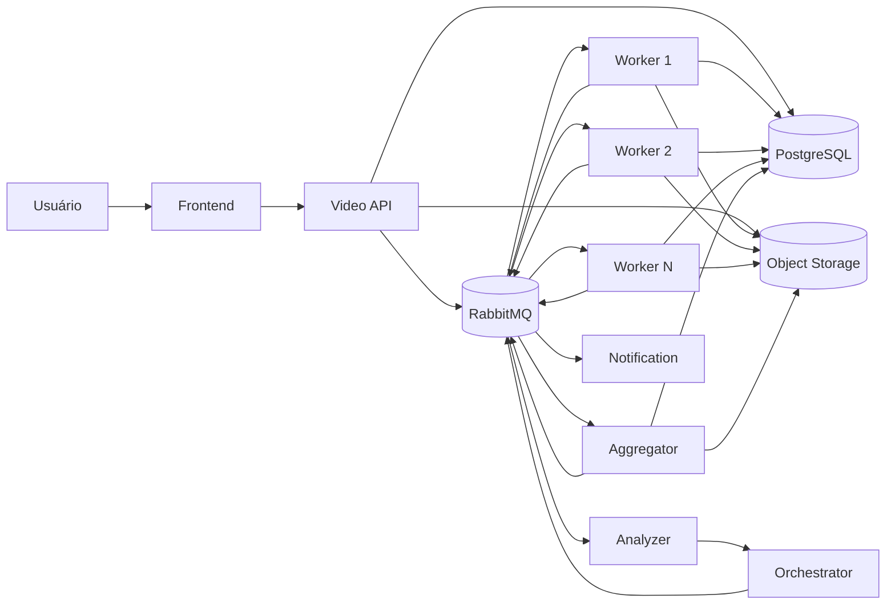

# video-processing-platform

Plataforma distribuída de processamento de vídeos para extração escalável de frames e geração de arquivos ZIP.

Este pacote foi preparado para **execução do projeto**, não apenas como esqueleto documental. Ele contém:

- arquitetura definida;
- requisitos funcionais e não funcionais;
- SDD + phase gates;
- ADRs;
- backlog detalhado por épico;
- tarefas técnicas;
- critérios de aceite;
- cenários Gherkin;
- estratégia de testes;
- contratos de API e eventos;
- modelo de dados;
- segurança;
- observabilidade;
- CI/CD;
- plano de implementação.

## Stack proposta

- Firebase Authentication
- TypeScript
- Node.js
- NestJS
- PostgreSQL
- RabbitMQ
- FFmpeg / ffprobe
- Object Storage
- Docker / Docker Compose
- Jest
- OpenTelemetry
- Prometheus
- Grafana

## Fluxo funcional



## Ordem de execução

```text
EPIC-001 Foundation & Architecture
EPIC-002 Identity & Access
EPIC-003 Video Management
EPIC-004 Distributed Video Processing
EPIC-005 Aggregation & Download
EPIC-006 Notifications
EPIC-007 Observability & DevOps
```

## Como usar este pacote

1. Leia `docs/product/vision.md`.
2. Leia `docs/development/sdd-workflow.md`.
3. Execute os épicos em ordem.
4. Para cada épico:
   - leia `spec.md`;
   - leia `requirements.md`;
   - valide `design.md`;
   - confirme `acceptance.md`;
   - implemente pelas tarefas de `tasks.md`;
   - escreva/execute os testes descritos em `testing.md`;
   - mantenha o `traceability.md` atualizado.
5. Não avance de gate sem cumprir os critérios do gate anterior.

## Estrutura

```text
docs/
  product/
  architecture/
  decisions/
  development/
  security/
  observability/
  devops/
  traceability/
  runbooks/

specs/
  EPIC-001-foundation-architecture/
  EPIC-002-identity-access/
  EPIC-003-video-management/
  EPIC-004-distributed-video-processing/
  EPIC-005-aggregation-download/
  EPIC-006-notifications/
  EPIC-007-observability-devops/

templates/
```

## Execução local da fundação

```bash
npm ci
npm run compose:up
curl --fail http://localhost:3000/health/live
curl --fail http://localhost:3000/health/ready
```

Para encerrar:

```bash
npm run compose:down
```

Commits e pushes diretos para `main`, `develop` e `homol` são bloqueados pelos hooks locais. Consulte `docs/development/git-workflow.md` para Conventional Commits e proteção remota no GitHub.
