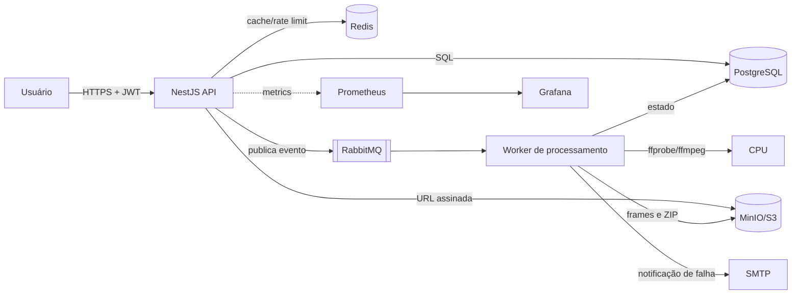

# FIAP X — Plataforma de Processamento de Vídeos

Plataforma distribuída para **upload, processamento assíncrono e download** de vídeos. Ela converte um
vídeo em um ZIP contendo os frames extraídos, de forma escalável, idempotente e observável.

O projeto é um monorepo **TypeScript + NestJS**, com serviços desacoplados por mensageria
(**RabbitMQ**), persistência relacional (**PostgreSQL**) e armazenamento de objetos (**MinIO/S3**).

---

## 1. Visão do produto

Um usuário autenticado envia um vídeo. A API valida o arquivo, persiste os metadados e publica o evento
`VideoUploaded`. O worker, em etapas independentes, analisa o vídeo, divide em _chunks_, extrai frames em
paralelo, agrega os resultados e gera um ZIP com os frames em ordem determinística. O usuário acompanha o
status e baixa o ZIP por uma URL assinada.

Principais capacidades:

- Autenticação com JWT e isolamento por usuário.
- Upload com validação de formato, tamanho e assinatura do arquivo.
- Processamento paralelo de chunks com `ffprobe`/`ffmpeg`.
- Fila durável com retry, backoff e DLQ.
- Idempotência e transições de estado protegidas por compare-and-set.
- Rate limiting por Redis.
- Observabilidade: logs estruturados, métricas Prometheus, health checks e provisionamento do Grafana.

---

## 2. Arquitetura

### 2.1 Visão geral



### 2.2 Bounded contexts

| Contexto           | Responsabilidade                                                       |
| ------------------ | ---------------------------------------------------------------------- |
| `identity`         | Cadastro, login e validação de JWT                                     |
| `video-management` | Upload, metadados, dono, status, listagem e download                   |
| `video-processing` | Análise, chunking, execução paralela, agregação e empacotamento do ZIP |
| `notification`     | Reação a falhas de processamento e envio de e-mail                     |
| `platform`         | Configuração, logger, health, métricas, rate limiting e tracing        |

A regra de dependência é verificada pelo `dependency-cruiser` no CI:

```text
domain          -> (nada)
application     -> domain
infrastructure  -> application, domain
presentation    -> application
main            -> tudo
```

### 2.3 Fluxo de processamento

```text
upload -> analyze -> plan chunks -> process chunks (paralelo) -> aggregate -> package ZIP -> download
```

Cada etapa é um consumidor independente e idempotente. Chunks em `PROCESSING` possuem _lease_
(`worker_id` + `locked_until`); um reaper devolve para `PENDING` apenas as leases expiradas.

---

## 3. Tecnologias

- **Linguagem/stack:** TypeScript strict, NestJS, `amqplib`, TypeORM, Zod, Pino
- **Mensageria:** RabbitMQ (topic exchange, retry/DLQ)
- **Banco:** PostgreSQL
- **Storage:** MinIO (compatível com S3)
- **Cache/rate limit:** Redis
- **Observabilidade:** Prometheus, Grafana, logs estruturados, `traceparent`
- **Testes:** Jest (unit, integração com Testcontainers, e2e com Supertest)

---

## 4. Estrutura do repositório

```text
apps/
  api/       # composition root da API
  worker/    # composition root do worker
  web/       # página estática: upload, status e download
src/
  contexts/  # identity, video-management, video-processing, notification
  platform/  # config, logger, metrics, health, rate-limit, tracing
  main/      # módulos Nest e composition root
test/
  unit/ integration/ e2e/
docs/        # análise AS-IS, arquitetura TO-BE, especificação e plano
infra/       # docker-compose, Dockerfiles, Prometheus/Grafana
legacy/      # protótipo Go original, preservado apenas como referência
```

---

## 5. Como rodar

### 5.1 Pré-requisitos

- Node.js >= 22
- Docker e Docker Compose
- `ffmpeg`/`ffprobe` disponíveis no `PATH` do worker (a imagem Docker já os instala)

### 5.2 Subir dependências

```bash
docker compose -f infra/docker-compose.yml up -d postgres rabbitmq redis minio mailhog
```

### 5.3 Configuração

Copie `.env.example` para `.env` e ajuste os valores. As variáveis principais são:

| Variável                   | Descrição                          |
| -------------------------- | ---------------------------------- |
| `DATABASE_URL`             | URL do PostgreSQL                  |
| `RABBITMQ_URL`             | URL do RabbitMQ                    |
| `REDIS_URL`                | URL do Redis                       |
| `S3_ENDPOINT`              | Endpoint do MinIO/S3               |
| `S3_BUCKET`                | Bucket de armazenamento            |
| `JWT_SECRET`               | Segredo do JWT                     |
| `CHUNK_SECONDS`            | Duração de cada chunk (segundos)   |
| `MAX_CHUNKS`               | Número máximo de chunks            |
| `MAX_VIDEO_SIZE_BYTES`     | Tamanho máximo de upload           |
| `DOWNLOAD_URL_TTL_SECONDS` | TTL das URLs assinadas de download |

### 5.4 Instalar e subir

```bash
npm install
npm run build
npm run start:api
npm run start:worker
```

A API sobe em `http://localhost:3000`.

### 5.5 Página web

Sirva a pasta `apps/web` com qualquer servidor estático, por exemplo:

```bash
npx http-server apps/web -p 5173 -c-1
```

A página fala com a API em `http://localhost:3000` (ajuste a constante `API_BASE` em
`apps/web/app.js` se necessário).

### 5.6 Observabilidade

O `docker-compose.yml` também provisiona Prometheus e Grafana:

- Prometheus: `http://localhost:9090`
- Grafana: `http://localhost:3001`

Endpoints da API:

- `GET /health/live` — processo vivo
- `GET /health/ready` — dependências prontas
- `GET /metrics` — métricas Prometheus

---

## 6. API

Nesta implementação as rotas são servidas na raiz, sem prefixo de versão.

| Método | Rota                   | Auth | Descrição               |
| ------ | ---------------------- | ---- | ----------------------- |
| POST   | `/auth/register`       | não  | Cadastro de usuário     |
| POST   | `/auth/login`          | não  | Login e emissão de JWT  |
| GET    | `/auth/me`             | sim  | Usuário autenticado     |
| POST   | `/videos`              | sim  | Upload multipart        |
| GET    | `/videos`              | sim  | Lista vídeos do usuário |
| GET    | `/videos/:id`          | sim  | Status do vídeo         |
| GET    | `/videos/:id/download` | sim  | URL assinada do ZIP     |
| GET    | `/health/live`         | não  | Liveness                |
| GET    | `/health/ready`        | não  | Readiness               |
| GET    | `/metrics`             | não  | Métricas Prometheus     |

---

## 7. Testes e qualidade

```bash
npm run test:unit
npm run test:integration
npm run test:e2e
npm run test:cov
npm run typecheck
npm run lint
```

Os testes de integração sobem as dependências com Testcontainers (PostgreSQL, RabbitMQ, MinIO e Redis)
e usam FFmpeg real com vídeos de fixture. O CI valida lint, typecheck, testes com cobertura e build.

---

## 8. Documentação complementar

- [`docs/01-analise-projeto-base.md`](docs/01-analise-projeto-base.md) — análise do legado
- [`docs/02-arquitetura-alvo.md`](docs/02-arquitetura-alvo.md) — arquitetura TO-BE e ADRs
- [`docs/03-especificacao-funcional.md`](docs/03-especificacao-funcional.md) — domínio, casos de uso e contratos
- [`docs/04-plano-de-implementacao.md`](docs/04-plano-de-implementacao.md) — fases, CI/CD e DoD

---

## 9. Roteiro da demo

1. Suba as dependências, a API e o worker.
2. Abra a página `apps/web` e cadastre um usuário.
3. Envie um vídeo e acompanhe o status até `COMPLETED`.
4. Clique em **Baixar** para obter o ZIP com os frames.
5. Abra o Grafana e mostre as métricas de processamento e de vídeos por status.
6. Envie três vídeos em paralelo para demonstrar escalabilidade.
