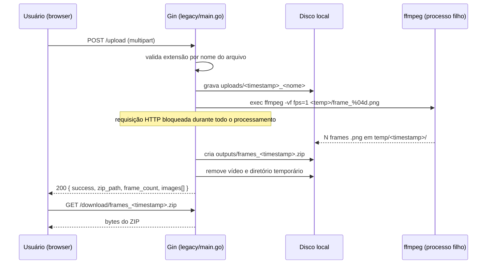

# 01 — Análise do Projeto Base (AS-IS)

> Objetivo: entender exatamente o que o projeto entregue faz, quais são seus limites e
> como cada pedaço dele será decomposto na nova plataforma.
>
> **Localização:** o código original está em [`../legacy/`](../legacy/README.md) e não faz parte da
> plataforma. Os caminhos abaixo apontam para lá e as referências de linha continuam válidas.

## 1. Escopo da análise

| Arquivo                          | Linhas | Papel                                                                  |
| -------------------------------- | ------ | ---------------------------------------------------------------------- |
| `legacy/main.go`                 | 496    | **Toda** a aplicação: HTTP, upload, FFmpeg, ZIP, download, status e UI |
| `go.mod` / `go.sum`              | —      | Uma única dependência direta: `gin-gonic/gin`                          |
| `legacy/Dockerfile`              | 22     | Container único, roda `go run main.go`                                 |
| `uploads/`, `outputs/`, `temp/`  | —      | Estado da aplicação em **disco local**                                 |
| `__MACOSX/`, `*:Zone.Identifier` | —      | Artefatos de download (macOS/Windows), não são código                  |

O projeto base é explicitamente rotulado no próprio `Dockerfile` como
_"sem boas práticas - propositalmente!"_. Ele é um **protótipo de apresentação**,
não uma base arquitetural.

## 2. Inventário funcional do que existe hoje

### 2.1 Rotas expostas (`legacy/main.go:51-60`)

| Método | Rota                       | Handler                                   | Responsabilidade                                                                    |
| ------ | -------------------------- | ----------------------------------------- | ----------------------------------------------------------------------------------- |
| GET    | `/`                        | closure inline                            | Devolve um HTML com formulário de upload                                            |
| POST   | `/upload`                  | `handleVideoUpload` (`legacy/main.go:75`) | Recebe multipart, salva em disco, processa **sincronamente** e responde o resultado |
| GET    | `/download/:filename`      | `handleDownload` (`legacy/main.go:236`)   | Serve um `.zip` de `./outputs`                                                      |
| GET    | `/api/status`              | `handleStatus` (`legacy/main.go:253`)     | Lista os `.zip` presentes em `./outputs`                                            |
| GET    | `/uploads/*`, `/outputs/*` | `gin.Static`                              | **Expõe os diretórios inteiros** publicamente                                       |

### 2.2 Funções e responsabilidades misturadas

| Função                           | Linha     | O que faz                                                                                           | Camadas que ela viola simultaneamente                           |
| -------------------------------- | --------- | --------------------------------------------------------------------------------------------------- | --------------------------------------------------------------- |
| `main`                           | 30        | Sobe HTTP, registra rotas, cria diretórios, configura CORS                                          | Composition root + apresentação + infraestrutura                |
| `createDirs`                     | 68        | Cria `uploads/`, `outputs/`, `temp/`                                                                | Infraestrutura (I/O) chamada no boot                            |
| `handleVideoUpload`              | 75        | Valida extensão, gera nome com timestamp, grava arquivo, chama FFmpeg, apaga o vídeo, responde JSON | Apresentação + aplicação + domínio + infraestrutura             |
| `processVideo`                   | 126       | Executa `ffmpeg`, faz glob dos frames, monta o ZIP, monta a resposta                                | Domínio + infraestrutura + apresentação (monta DTO de resposta) |
| `createZipFile` / `addFileToZip` | 187 / 207 | Compactação manual de arquivos                                                                      | Infraestrutura                                                  |
| `handleDownload`                 | 236       | Monta path por concatenação, serve arquivo                                                          | Apresentação com **path traversal**                             |
| `handleStatus`                   | 253       | Faz glob do diretório, `os.Stat`, monta JSON                                                        | Apresentação lendo o filesystem diretamente                     |
| `isValidVideoFile`               | 281       | Compara extensão contra uma lista                                                                   | Regra de negócio **dentro do handler**, duplicável              |
| `getHTMLForm`                    | 293       | 200+ linhas de HTML/CSS/JS embutidos no binário                                                     | Frontend acoplado ao backend                                    |

### 2.3 Fluxo atual (AS-IS)

Característica central: **processamento síncrono dentro do ciclo de request/response**.

## 3. Avaliação contra o desafio e os requisitos

Legenda: ✅ atendido · ⚠️ parcial · ❌ não atendido

| Requisito do hackathon                          | Status | Evidência                                                                          |
| ----------------------------------------------- | ------ | ---------------------------------------------------------------------------------- |
| Processar mais de um vídeo ao mesmo tempo       | ❌     | Cada request bloqueia; `temp/<timestamp>` e o nome do ZIP colidem no mesmo segundo |
| Não perder requisição em picos                  | ❌     | Sem fila; sem backpressure; sem retry; timeout do cliente = trabalho perdido       |
| Protegido por usuário e senha                   | ❌     | Nenhum middleware de autenticação; CORS `*` (`legacy/main.go:35`)                  |
| Listagem de status dos vídeos **de um usuário** | ❌     | `/api/status` lista arquivos do disco, sem noção de dono                           |
| Notificação em caso de erro                     | ❌     | Erro só retorna no JSON da resposta HTTP                                           |
| Persistir dados                                 | ❌     | Estado = filesystem; nada sobrevive a um redeploy                                  |
| Arquitetura escalável                           | ❌     | Monólito single-file, estado local, processamento in-process                       |
| Versionado no GitHub                            | ⚠️     | Apenas o repositório de destino existe (`video-processing-platform`)               |
| Testes que garantam qualidade                   | ❌     | Zero arquivos de teste                                                             |
| CI/CD                                           | ❌     | Nenhum workflow                                                                    |
| Docker / Compose / K8s                          | ⚠️     | Um `Dockerfile` de desenvolvimento (`go run` no CMD)                               |
| Mensageria                                      | ❌     | Ausente                                                                            |
| PostgreSQL + Redis                              | ❌     | Ausente                                                                            |
| Monitoramento                                   | ❌     | Apenas `fmt.Println` para stdout                                                   |

## 4. Problemas identificados (o que a decomposição precisa resolver)

| #   | Severidade | Problema                                                                       | Evidência                       | Impacto                                                                                                                           |
| --- | ---------- | ------------------------------------------------------------------------------ | ------------------------------- | --------------------------------------------------------------------------------------------------------------------------------- |
| P1  | 🔴         | Processamento síncrono no request                                              | `legacy/main.go:75-125`         | Não escala; pico derruba o serviço; timeout do cliente perde trabalho                                                             |
| P2  | 🔴         | Sem autenticação/autorização                                                   | todo o `legacy/main.go`         | Qualquer um lê/escreve tudo; IDOR em `/download/:filename`                                                                        |
| P3  | 🔴         | `filepath.Join("outputs", filename)` sem validar/sanitizar o parâmetro de rota | `legacy/main.go:237-238`        | Sem whitelist de nome de arquivo: traversal e caminhos absolutos passam a depender só do roteador. Defesa em profundidade ausente |
| P4  | 🔴         | Estado em disco local                                                          | `uploads/`, `outputs/`, `temp/` | Não escala horizontalmente; perde dados em restart; sem multi-réplica                                                             |
| P5  | 🔴         | Validação só por extensão do nome                                              | `legacy/main.go:281-289`        | Arquivo malicioso com `.mp4` passa; sem checagem de tamanho/MIME real                                                             |
| P6  | 🟠         | Nome de arquivo gerado por timestamp com precisão de segundo                   | `legacy/main.go:89`             | Colisão/sobrescrita em uploads concorrentes                                                                                       |
| P7  | 🟠         | Sem idempotência nem retry                                                     | ausente                         | Reprocessamento duplicado; falha transitória perde o vídeo                                                                        |
| P8  | 🟠         | Sem observabilidade estruturada                                                | `fmt.Printf`                    | Impossível medir fila, falhas, latência; sem correlação                                                                           |
| P9  | 🟠         | Zero testes                                                                    | ausente                         | Nenhuma garantia de regressão                                                                                                     |
| P10 | 🟡         | HTML/CSS/JS embutidos no backend                                               | `legacy/main.go:293+`           | Frontend acoplado; dificulta evoluir UI                                                                                           |
| P11 | 🟡         | Sem `ffprobe`/metadados                                                        | —                               | Não dá para dividir em chunks, validar duração ou estimar progresso                                                               |
| P12 | 🟡         | Erros internos vazados ao cliente                                              | `legacy/main.go:80,95`          | Vazamento de detalhes de infraestrutura                                                                                           |
| P13 | 🟡         | Sem limite de tamanho de arquivo                                               | ausente                         | DoS trivial por upload gigante                                                                                                    |
| P14 | 🟡         | `CORS: *` + `Static` do diretório de uploads                                   | `legacy/main.go:35,48`          | Expõe arquivos enviados por outros usuários                                                                                       |

## 5. O que o projeto base faz bem (e deve ser preservado)

- **O comando FFmpeg central é correto e reaproveitável**: `ffmpeg -i <video> -vf fps=1 frame_%04d.png`
  (`legacy/main.go:139-146`) é a definição funcional da extração de frames. Vira o contrato do adapter
  `FFmpegFrameExtractor`.
- **A taxonomia de extensões aceitas** (`.mp4 .avi .mov .mkv .wmv .flv .webm`, `legacy/main.go:283`) é um bom
  ponto de partida para o Value Object `VideoFormat`.
- **O formato de resposta** (`success`, `message`, `zip_path`, `frame_count`, `images`) já antecipa o
  que a API de status/download precisa expor, agora com `videoId` e `status`.

## 6. Decomposição: legado → nova plataforma

| Elemento do `legacy/main.go`     | Vira                                                                   | Camada / Contexto                                      |
| -------------------------------- | ---------------------------------------------------------------------- | ------------------------------------------------------ |
| `main()` + rotas                 | Controllers + `AppModule` (composition root)                           | `main` / `presentation`                                |
| `handleVideoUpload`              | `UploadVideoUseCase` (só orquestra)                                    | `video-management/application`                         |
| gravação em disco                | Port `VideoStorage` → adapter `S3VideoStorage`                         | `video-management/infrastructure`                      |
| `isValidVideoFile`               | Value Object `VideoFormat` + `VideoSize`                               | `video-management/domain`                              |
| `processVideo` (ffmpeg)          | Port `VideoProcessor` → `FFmpegVideoProcessor` + `FFprobeAnalyzer`     | `video-processing/infrastructure`                      |
| `-vf fps=1`                      | `ExtractFramesSpec` (Value Object)                                     | `video-processing/domain`                              |
| `createZipFile` / `addFileToZip` | Port `ArchiveStorage` → `ZipArchiveBuilder`                            | `video-processing/infrastructure`                      |
| `handleDownload`                 | `GetDownloadUrlUseCase` (URL assinada)                                 | `video-processing/application`                         |
| `handleStatus` (glob no disco)   | `ListUserVideosUseCase` + `GetVideoStatusUseCase`                      | `video-management/application`                         |
| `getHTMLForm`                    | Página `web` estática (`apps/web`)                                     | serviço de apresentação, fora dos contextos de domínio |
| `fmt.Printf`                     | Logger estruturado com `correlationId`/`videoId`                       | `platform`                                             |
| `Dockerfile`                     | Dockerfile multi-stage + `docker-compose.yml` + manifests K8s          | infraestrutura                                         |
| `uploads/ outputs/ temp/`        | Object Storage (MinIO/S3) + volumes gerenciados                        | infraestrutura                                         |
| _(não existe)_                   | Publicação de eventos `VideoUploaded`, `ChunkCompleted`... em RabbitMQ | `video-processing/application`                         |
| _(não existe)_                   | Contexto `identity` (login, JWT, dono do recurso)                      | `identity`                                             |
| _(não existe)_                   | Contexto `notification` (falha → e-mail)                               | `notification`                                         |

## 7. É exigido manter a linguagem?

**Não.** O documento do hackathon não fixa linguagem em nenhum momento.

O que ele diz:

- "*STACK TECNOLÓGICA **RECOMENDADA**" → recomendação, não obrigação.
- Os itens listados são **infraestrutura**, não linguagem: Docker + Compose/K8s, RabbitMQ/Kafka,
  PostgreSQL + Redis, Prometheus/Grafana ou ELK, GitHub Actions.
- "Desenvolver uma aplicação utilizando os conceitos apresentados" → o critério de avaliação são os
  **conceitos** (arquitetura, microsserviços, qualidade, mensageria), não a sintaxe.
- O projeto base é classificado como ponto de partida sem boas práticas — ele é insumo, não referência
  a ser mantida.

Ou seja: manter Go, migrar para TypeScript ou ir para Java/C# são todos caminhos válidos **pelo
edital**. A escolha deve ser feita por critérios de risco e de aderência ao que você será avaliado.

## 8. Adaptar para outra linguagem: questões a considerar

| Dimensão                         | Pergunta a responder                                                 | Por que importa aqui                                                                                                                                                                |
| -------------------------------- | -------------------------------------------------------------------- | ----------------------------------------------------------------------------------------------------------------------------------------------------------------------------------- |
| **Peso do trabalho pesado**      | Onde está o CPU-bound?                                               | Em todas as opções, a decodificação é feita pelo **FFmpeg como processo externo**. A linguagem só orquestra processos e I/O → a vantagem de raw performance praticamente desaparece |
| **Modelo de concorrência**       | Como o serviço lida com N workers simultâneos?                       | Goroutines (Go), worker_threads/processos (Node), virtual threads (Java 21). Como o gargalo é o processo FFmpeg, o modelo importa menos que o controle de fila                      |
| **Ecossistema de mensageria**    | Existe client AMQP/Kafka maduro?                                     | Go (`amqp091-go`), Node (`amqplib`), Java (Spring AMQP). Todos OK; muda o custo de DLQ/retry/confirmação                                                                            |
| **Ecossistema de auth**          | JWT, RBAC, hash de senha, guards                                     | Node/NestJS tem Guards + Passport prontos; Go exige montar middleware                                                                                                               |
| **Persistência**                 | ORM vs query builder vs SQL puro + migrations                        | Decisão central para testabilidade e para o requisito "script de criação do banco"                                                                                                  |
| **Testes e cobertura**           | Existe runner, mocks de FFmpeg/rabbit, relatório de cobertura ≥ 80%? | **Item avaliado.** Jest (Node) e Testcontainers são maduros; Go tem `testing` + `testcontainers-go`                                                                                 |
| **Observabilidade**              | OpenTelemetry/Prometheus nativos?                                    | Exigido pelo edital                                                                                                                                                                 |
| **Curva de aprendizado do time** | Quanto tempo até o primeiro worker funcionando?                      | **Risco nº 1 em hackathon.** Trocar de linguagem custa dias                                                                                                                         |
| **Contrato do curso**            | O material do curso que você assistiu usa qual stack?                | Você mesmo disse: o hackathon avalia _tudo o que foi ensinado_ — se o curso é Node/NestJS, migrar cria atrito entre o que foi ensinado e o que será entregue                        |
| **Reuso do que existe**          | O que do `legacy/main.go` é reusável?                                | Apenas a **ideia** do comando FFmpeg e a lista de extensões. Não existe biblioteca de domínio a preservar → não há custo de reescrita                                               |
| **Poliglota ou monolíngue**      | Vale manter Go como worker e o resto em TS?                          | Válido e demonstrável (fronteira real de bounded context), mas dobra infraestrutura, CI e o esforço de integração                                                                   |
| **Deploy**                       | Imagem, cold start, memória                                          | Go gera binário estático ~15MB; Node exige runtime + `node_modules`. Relevante se houver K8s com réplicas                                                                           |

### 8.1 Recomendação

**Manter TypeScript + NestJS como linguagem da nova plataforma.**

Justificativa (regra de decisão do `AGENTS.md`: menor blast radius, menos conceitos, mais fácil de
testar, alinhado ao que será avaliado):

1. O repositório de destino (`video-processing-platform`) já declara TypeScript/RabbitMQ/FFmpeg/
   PostgreSQL no próprio `README.md`, e o `AGENTS.md` do projeto já define a arquitetura em
   TS/NestJS. Mudar de linguagem agora invalidaria essa especificação.
2. O ganho de performance do Go é irrelevante: o trabalho pesado é o binário `ffmpeg`.
3. O ecossistema Node/NestJS entrega de graça itens **avaliados**: Guards/JWT, DI, `@nestjs/microservices`
   (RabbitMQ), TypeORM/Prisma + migrations, Jest com cobertura, Pino + OpenTelemetry, Swagger.
4. O projeto base em Go **não tem código de domínio a preservar** — descartá-lo custa quase nada.

**Alternativas legítimas, com trade-off explícito:**

- _Go na plataforma toda_: melhor ergonomia de concorrência e imagem menor; custo alto de montar
  auth, ORM, DI, mocks e cobertura. Só vale se o time for fluente em Go e iniciante em TS.
- _Poliglota (Go como worker de processamento)_: excelente narrativa de arquitetura (dois bounded
  contexts, dois runtime, contrato por evento). Aumenta esforço de infra, CI e depuração — viável
  como **stretch goal**, não como caminho principal.
- _Java/Kotlin/C#_: ecossistema forte, mas custo de bootstrap maior que o retorno no prazo do hackathon.

### 8.2 Decisões tomadas

Revisadas em grupo. O registro completo, com o impacto de cada uma nos outros documentos, está em
[`README.md`](README.md#registro-de-decisões-da-revisão).

| #   | Decisão                       | Escolha                                                                                |
| --- | ----------------------------- | -------------------------------------------------------------------------------------- |
| 1   | Linguagem da plataforma       | **TypeScript + NestJS**                                                                |
| 2   | Estilo de serviço             | **Microsserviços modulares**: `api`, `worker` e `web` independentes                    |
| 3   | Extração de frames            | Mantido `fps=1`, igual ao projeto base                                                 |
| 4   | Redis                         | **Rate limiting** (login e upload); não é cache de status                              |
| 5   | Frontend                      | Página `web` simples: upload, status e download                                        |
| 6   | Recuperação de chunk travado  | Lease com `worker_id` + `locked_until`                                                 |
| 7   | Notificações                  | Tabela `notifications` própria do contexto                                             |
| 8   | Imagens Docker                | Duas: `api` sem FFmpeg, `worker` com FFmpeg                                            |
| 9   | Object storage                | MinIO local (S3-compatível)                                                            |
| 10  | E-mail                        | MailHog em desenvolvimento, provedor real em produção                                  |
| 11  | Destino do projeto base em Go | Movido para [`legacy/`](../legacy/README.md), versionado como material de apresentação |
