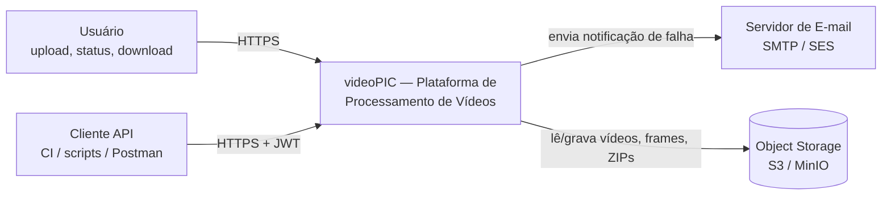
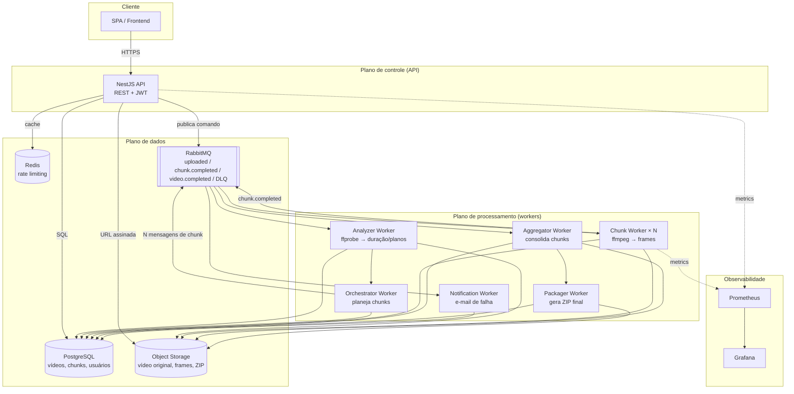
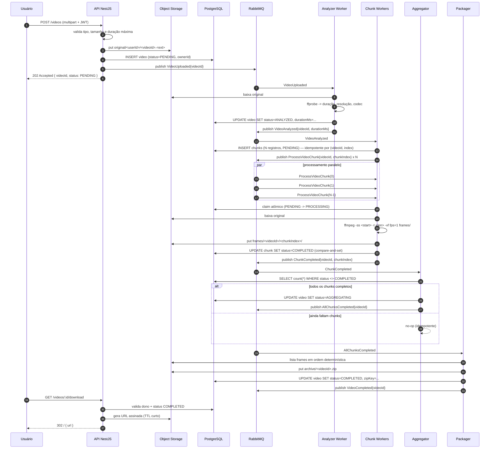

# 02 — Arquitetura Alvo (TO-BE)

## 1. Princípios norteadores

1. **Dependências apontam para dentro.** `presentation`/`infrastructure` dependem de
   `application`/`domain`; nunca o contrário.
2. **O domínio não conhece fornecedor.** Nem `ffmpeg`, nem RabbitMQ, nem S3, nem ORM.
3. **Contratos por capacidade, não por provedor.** `VideoStorage`, não `S3Client`.
4. **Mensagem nunca é entregue uma única vez.** Todo consumidor é idempotente.
5. **Estado sensível a concorrência é protegido no banco**, não em `if` na memória.
6. **Trabalho pesado é do FFmpeg.** Node orquestra processos; não decodifica frames.
7. **Menos conceitos.** Sem CQRS, sem event sourcing, sem saga genérica — só o que o problema exige.

## 2. Visão C4 — nível 1 (contexto)



## 3. Visão C4 — nível 2 (containers)



**Decisão de deploy: microsserviços modulares em monorepo.** Cada serviço tem imagem Docker, job de
build, escala e ciclo de vida próprios:

| Serviço  | Papel                                                             | Escala por                 |
| -------- | ----------------------------------------------------------------- | -------------------------- |
| `api`    | REST + JWT, publica comandos, gera URLs assinadas                 | requisição (HTTP)          |
| `worker` | Analyzer, Orchestrator, Chunk, Aggregator, Packager, Notification | CPU / profundidade da fila |
| `web`    | SPA estática (upload, listagem de status, download)               | requisição                 |

O código de domínio é compartilhado (`src/contexts`, `src/platform`) para não duplicar regra de negócio,
mas **nenhum serviço importa o bootstrap do outro**. A única integração é o contrato de mensagem e o
banco — é isso que permite extrair qualquer serviço para repositório próprio sem reescrita.

Trade-off assumido: schema compartilhado entre `api` e `worker`, com cada contexto dono das suas
tabelas. Banco por serviço seria mais puro, mas introduz transação distribuída sem retorno no prazo
do hackathon (ADR-002). A fronteira que importa — "nenhum contexto escreve na tabela do outro" — é
mantida e verificável por lint.

## 4. Bounded contexts

Só quatro contextos têm fronteira real. Qualquer outro seria abstração para requisito hipotético.

| Contexto           | Responsabilidade                                                                   | Não faz                                    |
| ------------------ | ---------------------------------------------------------------------------------- | ------------------------------------------ |
| `identity`         | Cadastro, login, emissão/validação de JWT, identidade do usuário                   | Não conhece vídeo                          |
| `video-management` | Ciclo de vida do vídeo: upload, metadados, dono, status, listagem, URL de download | Não executa FFmpeg                         |
| `video-processing` | Análise, chunking, execução paralela, agregação, ZIP                               | Não sabe quem é o dono nem como autenticar |
| `notification`     | Reagir a `VideoProcessingFailed` e notificar o dono                                | Não decide quando falhou                   |

### 4.1 Por que essa separação

- `identity` tem razão de mudar própria (política de senha, provedor de identidade).
- `video-management` é **estado e autorização**; tem transações e invariantes de ownership.
- `video-processing` é **compute**; escala por CPU, não por requisição, e é onde o FFmpeg vive.
- `notification` é **efeito colateral externo**; isolar evita que falha de SMTP derrube a API.

## 5. Fluxo de processamento (TO-BE)



### 5.1 Estratégia de chunking

- `Analyzer` obtém `durationMs` via `ffprobe`.
- `Orchestrator` divide em janelas de **duração fixa** (`CHUNK_SECONDS`, padrão 10s), com no máximo
  `MAX_CHUNKS` (proteção contra vídeos degenerados).
- Chunk `i` cobre `[i * chunkSeconds, min((i+1) * chunkSeconds, total))`.
- **Nomes de frame determinísticos:** `frame_%06d.png` com `-start_number = floor(startSeconds)`, já que
  `fps=1` produz 1 frame por segundo. Reprocessar o mesmo chunk gera **exatamente** os mesmos nomes, o
  que dá idempotência e ordenação natural na hora de montar o ZIP.
  A idempotência é de **chave de objeto**, não de byte: reprocessar pode produzir um frame de fronteira
  visualmente diferente (`-ss` é seek aproximado), mas sobrescreve o mesmo objeto e a contagem de frames
  não muda. É o que o requisito exige — nunca dois objetos para o mesmo segundo.
- Vídeo curto (menor ou igual a `CHUNK_SECONDS`) gera **1 chunk**: o caminho simples continua existindo.

## 6. Estrutura de pastas

```text
video-processing-platform/
├── apps/
│   ├── api/                          # composition root do plano de controle
│   │   └── src/main.ts
│   ├── worker/                       # composition root do plano de processamento
│   │   └── src/main.ts
│   └── web/                          # página estática: upload, status, download
│       └── src/
├── src/
│   ├── contexts/
│   │   ├── identity/
│   │   │   ├── domain/               # User, Email, PasswordHash, domain errors
│   │   │   ├── application/          # RegisterUser, Authenticate, ports
│   │   │   ├── infrastructure/       # TypeORM user repo, bcrypt hasher, JWT issuer
│   │   │   └── presentation/         # AuthController, JwtGuard
│   │   ├── video-management/
│   │   │   ├── domain/               # Video, VideoStatus, VideoFormat, VideoSize, ownership
│   │   │   ├── application/          # UploadVideo, ListUserVideos, GetVideoStatus,
│   │   │   │                         # RequestDownload, ports
│   │   │   ├── infrastructure/       # PostgresVideoRepository, S3VideoStorage
│   │   │   └── presentation/         # VideosController
│   │   ├── video-processing/
│   │   │   ├── domain/               # Chunk, ChunkStatus, ChunkPlan, ExtractFramesSpec
│   │   │   ├── application/          # AnalyzeVideo, PlanChunks, ProcessChunk,
│   │   │   │                         # AggregateChunks, PackageArchive, ports
│   │   │   ├── infrastructure/       # FFmpegFrameExtractor, FFprobeAnalyzer,
│   │   │   │                         # ZipArchiveBuilder, S3FrameStorage
│   │   │   └── presentation/         # consumers: VideoUploaded, ChunkCompleted
│   │   └── notification/
│   │       ├── domain/               # NotificationMessage, NotificationChannel
│   │       ├── application/          # NotifyProcessingFailure, ports
│   │       ├── infrastructure/       # SmtpNotificationGateway
│   │       └── presentation/         # consumer: VideoProcessingFailed
│   ├── platform/                     # logger, config, otel, health, clock, id generator
│   └── main/                         # módulos Nest, DI, bootstrap HTTP e consumers
├── test/
│   ├── unit/
│   ├── integration/                  # Testcontainers: Postgres, RabbitMQ, MinIO
│   └── e2e/
├── docs/
├── infra/
│   ├── docker-compose.yml
│   ├── docker/                       # Dockerfiles multi-stage
│   ├── db/                           # 01-schema.sql, 02-seed.sql
│   └── k8s/                          # manifests (opcional)
└── .github/workflows/ci.yml
```

### 6.1 Regra de dependência (verificável por lint, não por disciplina)

```text
domain          -> (nada)
application     -> domain
infrastructure  -> application, domain
presentation    -> application (e domain para erros/tipos)
main            -> tudo (único lugar que conhece implementação)
```

Adicionar `eslint-plugin-boundaries` ou `dependency-cruiser` no CI para **quebrar o build** se a
direção for violada. Regra que só existe em documento não sobrevive à pressa do hackathon.

## 7. Infraestrutura

### 7.1 Serviços do `docker-compose.yml`

| Serviço      | Imagem                  | Papel                                      | Porta        |
| ------------ | ----------------------- | ------------------------------------------ | ------------ |
| `postgres`   | `postgres:16-alpine`    | Persistência                               | 5432         |
| `rabbitmq`   | `rabbitmq:3-management` | Mensageria + UI                            | 5672 / 15672 |
| `redis`      | `redis:7-alpine`        | Rate limiting (login e upload)             | 6379         |
| `minio`      | `minio/minio`           | Object storage S3-compatível               | 9000 / 9001  |
| `mailhog`    | `mailhog/mailhog`       | SMTP de desenvolvimento + UI               | 1025 / 8025  |
| `api`        | build local             | Plano de controle                          | 3000         |
| `worker`     | build local             | Plano de processamento (`--concurrency=N`) | —            |
| `web`        | build estático + nginx  | Página de upload, status e download        | 8080         |
| `prometheus` | `prom/prometheus`       | Coleta de métricas                         | 9090         |
| `grafana`    | `grafana/grafana`       | Dashboards                                 | 3001         |

Mínimo entregável: `postgres`, `rabbitmq`, `minio`, `api`, `worker`, `web`.

### 7.2 Dockerfiles

Duas imagens multi-stage, usuário não-root, `CMD ["node","dist/..."]` — nunca `go run`/`ts-node` em produção:

| Imagem   | Base                                | Conteúdo                                  | Observação                                |
| -------- | ----------------------------------- | ----------------------------------------- | ----------------------------------------- |
| `api`    | `node:22-alpine`                    | runtime Node + `dist/` da API             | **sem FFmpeg**                            |
| `worker` | `node:22-alpine` + `apk add ffmpeg` | runtime Node + FFmpeg + `dist/` do worker | única imagem que executa binário de mídia |

A API não executa mídia, então não carrega a superfície de ataque do FFmpeg (ADR-011). O `Dockerfile` do
projeto base (`go run` em produção) é um anti-exemplo: não replicar.

### 7.3 K8s (opcional / demonstração)

- `Deployment` da API com `HorizontalPodAutoscaler`.
- `Deployment` do worker com escala por fila RabbitMQ via KEDA (0 a 4 réplicas no Kubernetes local).
- `CronJob` de retenção (apagar frames antigos).
- `ConfigMap`/`Secret` para configuração.

## 8. Observabilidade

**Logs estruturados (Pino)** — todo log carrega o contexto:

```json
{
  "level": "info",
  "correlationId": "...",
  "traceId": "...",
  "videoId": "...",
  "chunkIndex": 3,
  "msg": "chunk.completed"
}
```

Proibido logar: senha, token, header `Authorization`, credenciais, conteúdo do vídeo.

**Métricas (Prometheus em `/metrics`):**

| Métrica                             | Tipo      | Uso                        |
| ----------------------------------- | --------- | -------------------------- |
| `video_processing_duration_seconds` | Histogram | Latência ponta a ponta     |
| `videos_total{status}`              | Counter   | Sucesso vs falha           |
| `chunks_total{status}`              | Counter   | Sucesso vs falha por chunk |
| `queue_depth{queue}`                | Gauge     | Pressão na fila            |
| `active_workers`                    | Gauge     | Capacidade                 |
| `retry_total{queue}`                | Counter   | Saúde das integrações      |
| `http_request_duration_seconds`     | Histogram | Latência da API            |

**Traces (OpenTelemetry):** propagar `traceparent` do HTTP para a mensagem AMQP e de volta, para que
um upload e o ZIP final compartilhem o mesmo trace.

**Health:** `/health/live` (processo vivo) e `/health/ready` (Postgres + RabbitMQ + Redis + S3).

## 9. ADRs (Architecture Decision Records)

| ID      | Decisão                                                                                               | Status | Justificativa                                                                                                                                                 | Alternativa rejeitada                                                                                              |
| ------- | ----------------------------------------------------------------------------------------------------- | ------ | ------------------------------------------------------------------------------------------------------------------------------------------------------------- | ------------------------------------------------------------------------------------------------------------------ |
| ADR-001 | TypeScript + NestJS como linguagem da plataforma                                                      | Aceita | Ecossistema entrega auth, DI, mensageria, ORM, Jest e OTel; curso alinhado; FFmpeg é processo externo, performance do host é irrelevante                      | Reescrever em Go (custo alto de ecossistema, ganho nulo)                                                           |
| ADR-002 | Microsserviços modulares em monorepo: `api`, `worker` e `web` independentes, com schema compartilhado | Aceita | Cada serviço tem imagem, deploy e escala próprios, atendendo ao requisito de microsserviços; compartilhar o código de domínio evita duplicar regra de negócio | Banco por serviço (transação distribuída sem retorno no prazo) e repo por serviço (overhead de CI e versionamento) |
| ADR-003 | RabbitMQ (AMQP) em vez de Kafka                                                                       | Aceita | Roteamento por fila, DLQ nativa e UI de administração; volume do hackathon é baixo                                                                            | Kafka (overengineering para o volume)                                                                              |
| ADR-004 | Object storage (S3/MinIO) em vez de disco local                                                       | Aceita | Requisito de escala horizontal e de não perder dados                                                                                                          | Volume Docker compartilhado (não escala e não é durável)                                                           |
| ADR-005 | Chunking por janela de tempo com nomes de frame determinísticos                                       | Aceita | Idempotência e ordenação de graça; vídeo curto = 1 chunk                                                                                                      | Chunking por número de frames (exige conhecer fps real e complica o mapeamento)                                    |
| ADR-006 | Transições de estado com `UPDATE ... WHERE status = <esperado>`                                       | Aceita | Proteção atômica contra worker duplicado e crash                                                                                                              | Lock pessimista na aplicação                                                                                       |
| ADR-007 | Download por URL assinada com TTL curto                                                               | Aceita | Remove bytes do caminho da API; não expõe o storage                                                                                                           | Proxy de download pela API                                                                                         |
| ADR-008 | Redis **apenas** para rate limiting, não para cache de status                                         | Aceita | O edital recomenda Redis e o uso real é proteger login (brute force) e upload (abuso de CPU); listagem de status não tem leitura quente que justifique cache  | Cache de status (custo de invalidação sem ganho medido) e ausência de rate limit (brute force trivial)             |
| ADR-009 | Lease com `worker_id` + `locked_until` para chunks em `PROCESSING`                                    | Aceita | Distingue worker morto de worker lento e permite ao reaper recuperar só o que comprovadamente expirou                                                         | Recuperação por `updated_at` (rouba trabalho de worker saudável)                                                   |
| ADR-010 | Contexto `notification` com tabela própria                                                            | Aceita | Cada contexto escreve apenas nas suas tabelas; a idempotência do envio fica na própria tabela                                                                 | `videos.notified_at` (contexto escrevendo em tabela de outro)                                                      |
| ADR-011 | Imagens Docker separadas: `api` sem FFmpeg, `worker` com FFmpeg                                       | Aceita | Imagem da API menor e sem superfície de ataque que não usa                                                                                                    | Imagem única (build maior e FFmpeg exposto na API sem necessidade)                                                 |

## 10. Requisitos não-funcionais

| Categoria       | Requisito                               | Como é atendido                                                                                  |
| --------------- | --------------------------------------- | ------------------------------------------------------------------------------------------------ |
| Escalabilidade  | N vídeos simultâneos                    | Fila + N workers sem estado + storage compartilhado                                              |
| Resiliência     | Pico não perde requisição               | Fila durável (`persistent` + publisher confirms) e persistência antes de confirmar               |
| Confiabilidade  | Falha transitória não perde vídeo       | Retry com backoff + DLQ + reprocessamento manual                                                 |
| Idempotência    | Mensagem duplicada não duplica trabalho | `UNIQUE(video_id, chunk_index)`, compare-and-set no estado, consumidor faz no-op se já concluído |
| Segurança       | Ninguém acessa vídeo de outro           | `ownerId` no agregado + checagem em toda leitura + `404` para recurso de terceiro                |
| Segurança       | Upload malicioso                        | Validação de MIME real, extensão, tamanho máximo e limite de duração                             |
| Performance     | Não travar a API                        | Upload publica evento e devolve `202 Accepted`; `ffmpeg` roda em processos separados             |
| Observabilidade | Medir o que importa                     | Métricas, logs correlacionados e traces (seção 8)                                                |
| Custo           | Rodar local                             | Compose com imagens leves; worker com `concurrency` configurável                                 |
| Usabilidade     | Demonstrar o produto funcionando        | `web` com upload, listagem de status e download                                                  |
| Segurança       | Impedir brute force e abuso de upload   | Rate limiting em Redis com `429` + `Retry-After`                                                 |
