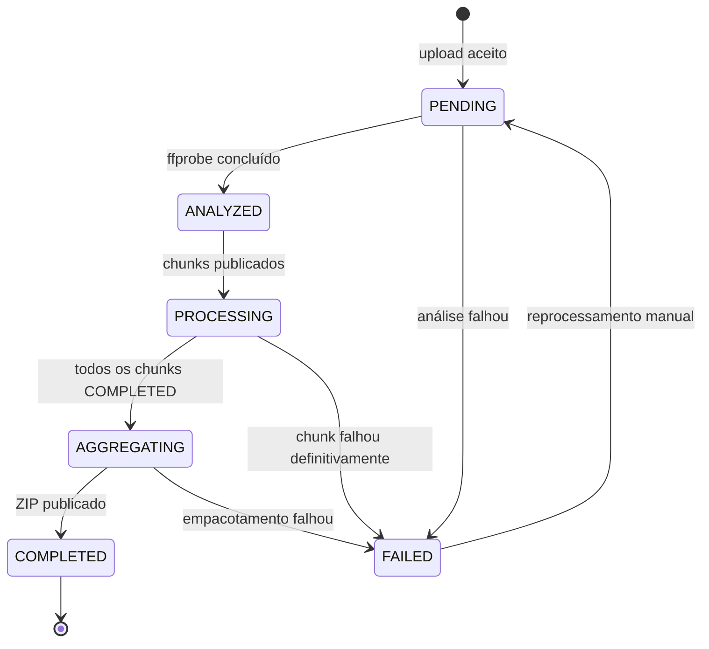
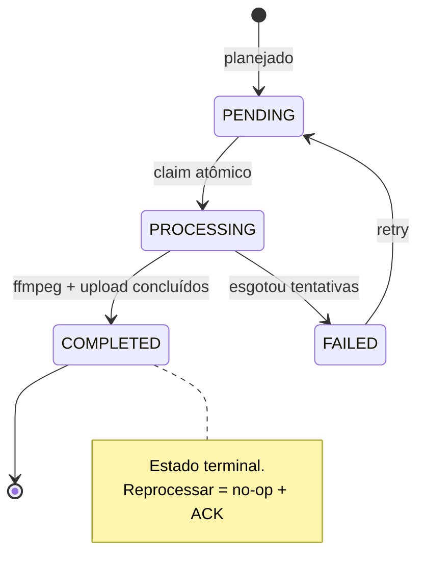

# 03 — Especificação Funcional e Técnica

## 1. Atores

| Ator              | Descrição                                    | Interações                                            |
| ----------------- | -------------------------------------------- | ----------------------------------------------------- |
| Usuário           | Pessoa autenticada, dona dos próprios vídeos | Cadastro, login, upload, consulta de status, download |
| Worker            | Processo assíncrono da plataforma            | Consome eventos, executa FFmpeg, atualiza estado      |
| Administrador     | Operação (fora do escopo funcional)          | Consulta a DLQ, reprocessa vídeo falho                |
| Serviço de e-mail | Destino externo                              | Recebe aviso de falha                                 |

## 2. Modelo de domínio

### 2.1 `identity`

| Elemento         | Tipo          | Invariantes                                                           |
| ---------------- | ------------- | --------------------------------------------------------------------- |
| `User`           | Entity (raiz) | `id` estável; `email` único e normalizado; senha nunca em texto claro |
| `Email`          | Value Object  | Formato válido, normalizado em minúsculas, tamanho máximo             |
| `PasswordHash`   | Value Object  | Nunca exposto em `toString`/log                                       |
| `PlainPassword`  | Value Object  | Regra mínima de força (comprimento, complexidade)                     |
| `UserRegistered` | Domain event  | —                                                                     |

### 2.2 `video-management`

| Elemento               | Tipo          | Invariantes                                                                                                                                   |
| ---------------------- | ------------- | --------------------------------------------------------------------------------------------------------------------------------------------- |
| `Video`                | Entity (raiz) | Sempre pertence a exatamente um `ownerId`; `status` só transita conforme a máquina de estados; `zipKey` só existe quando `status = COMPLETED` |
| `VideoId` / `UserId`   | Value Object  | Identificador opaco não vazio                                                                                                                 |
| `VideoFormat`          | Value Object  | Uma das extensões suportadas (`.mp4 .avi .mov .mkv .wmv .flv .webm`)                                                                          |
| `VideoSize`            | Value Object  | Maior que 0 e menor ou igual ao limite configurado                                                                                            |
| `VideoDuration`        | Value Object  | Maior que 0 e menor ou igual ao limite configurado                                                                                            |
| `VideoStatus`          | Value Object  | `PENDING`, `ANALYZED`, `PROCESSING`, `AGGREGATING`, `COMPLETED`, `FAILED`                                                                     |
| `VideoOwnershipPolicy` | Domain policy | `video.belongsTo(userId)`; acesso de terceiro resulta em `VideoNotAccessibleError`                                                            |

### 2.3 `video-processing`

| Elemento            | Tipo                  | Invariantes                                                                                                           |
| ------------------- | --------------------- | --------------------------------------------------------------------------------------------------------------------- |
| `ChunkPlan`         | Value Object / policy | Deriva a lista de janelas a partir de `VideoDuration` e `chunkSeconds`; nunca gera zero chunks; respeita `MAX_CHUNKS` |
| `Chunk`             | Entity                | Identificada por `(videoId, index)`; `index` em `[0, totalChunks)`; `COMPLETED` não volta para `PROCESSING`           |
| `ChunkStatus`       | Value Object          | `PENDING`, `PROCESSING`, `COMPLETED`, `FAILED`                                                                        |
| `ChunkLease`        | Value Object          | `workerId` + `lockedUntil`; renovada enquanto o worker está vivo; expira para permitir recuperação                    |
| `ExtractFramesSpec` | Value Object          | `fps=1`, `-start_number = floor(startSeconds)`, padrão de nome determinístico                                         |
| `FrameName`         | Value Object          | `frame_%06d.png`; ordenável lexicograficamente                                                                        |

### 2.4 Regras de negócio explícitas

| ID    | Regra                                                                                                                  | Onde vive                                                     |
| ----- | ---------------------------------------------------------------------------------------------------------------------- | ------------------------------------------------------------- |
| RN-01 | Um vídeo não pode ser agregado antes que **todos** os chunks estejam `COMPLETED`                                       | `ChunkCompletionPolicy` (domain)                              |
| RN-02 | Um chunk já `COMPLETED` não pode ser processado novamente                                                              | `Chunk.markAsProcessing()` lança `ChunkAlreadyCompletedError` |
| RN-03 | Uma transição de estado inválida deve falhar, não ser ignorada em silêncio                                             | `VideoStatus.canTransitionTo()`                               |
| RN-04 | Um usuário não pode acessar o vídeo de outro usuário                                                                   | `VideoOwnershipPolicy` + checagem no repositório              |
| RN-05 | O download só existe para vídeo `COMPLETED`                                                                            | `RequestDownloadUseCase`                                      |
| RN-06 | O frame de um chunk deve ter nome determinístico por segundo global                                                    | `ExtractFramesSpec`                                           |
| RN-07 | O upload só aceita formato, tamanho e MIME permitidos                                                                  | `VideoFormat`, `VideoSize` (domain)                           |
| RN-08 | Reenvio da mesma mensagem não pode duplicar frames nem chunks                                                          | `UNIQUE(video_id, chunk_index)` + compare-and-set             |
| RN-09 | Chunk em `FAILED` definitivo torna o vídeo `FAILED`; o vídeo nunca fica preso esperando um chunk que não vai completar | `ChunkFailurePolicy` (domain)                                 |

### 2.5 Máquina de estados do vídeo



Estados terminais: `COMPLETED` (sucesso) e `FAILED`. Qualquer transição fora do diagrama é erro de domínio.

### 2.6 Máquina de estados do chunk



`PROCESSING` não significa "está rodando agora": significa "alguém reivindicou e a lease ainda vale".
O claim grava `worker_id` e `locked_until`, e o _reaper_ só devolve o chunk para `PENDING` quando
`locked_until < now()`. Usar `updated_at` seria insuficiente, pois não distingue "worker lento" de
"worker morto" — e um vídeo longo seria roubado de um worker saudável.

## 3. Casos de uso

### 3.1 Visão geral

| ID    | Caso de uso                  | Contexto         | Ator    | Publica evento                             |
| ----- | ---------------------------- | ---------------- | ------- | ------------------------------------------ |
| UC-01 | Registrar usuário            | identity         | Usuário | —                                          |
| UC-02 | Autenticar                   | identity         | Usuário | —                                          |
| UC-03 | Enviar vídeo                 | video-management | Usuário | `VideoUploaded`                            |
| UC-04 | Listar vídeos do usuário     | video-management | Usuário | —                                          |
| UC-05 | Consultar status de um vídeo | video-management | Usuário | —                                          |
| UC-06 | Solicitar download do ZIP    | video-management | Usuário | —                                          |
| UC-07 | Analisar vídeo               | video-processing | Worker  | `VideoAnalyzed`                            |
| UC-08 | Planejar chunks              | video-processing | Worker  | `ProcessVideoChunk` × N                    |
| UC-09 | Processar chunk              | video-processing | Worker  | `ChunkCompleted` / `VideoProcessingFailed` |
| UC-10 | Agregar chunks               | video-processing | Worker  | `AllChunksCompleted`                       |
| UC-11 | Empacotar ZIP                | video-processing | Worker  | `VideoCompleted`                           |
| UC-12 | Notificar falha              | notification     | Worker  | —                                          |

### 3.2 UC-03 — Enviar vídeo

- **Ator:** Usuário autenticado
- **Pré-condições:** JWT válido; arquivo presente no multipart
- **Fluxo principal:**
  1. Controller valida o multipart e delega ao use case (sem regra de negócio no controller).
  2. Use case valida `VideoFormat`, `VideoSize` e o MIME real (magic bytes) via port.
  3. Gera `videoId` e a chave de destino no storage.
  4. Persiste o vídeo com `status = PENDING` e `ownerId` do token.
  5. Grava o binário no object storage via port `VideoStorage`.
  6. Publica `VideoUploaded{videoId, ownerId, storageKey, format, sizeBytes}`.
  7. Retorna `202 Accepted { videoId, status: PENDING }`.
- **Fluxos alternativos:**
  - Formato/MIME não suportado → `UnsupportedVideoFormatError` → `400`.
  - Arquivo maior que o limite → `VideoTooLargeError` → `413`.
  - Falha ao gravar no storage → remove o registro persistido e retorna `503`.
  - Falha ao publicar evento → registro permanece `PENDING` e um job de repescagem republica (garante "não perder requisição").
- **Invariantes:** RN-07; `ownerId` vem **sempre** do token, nunca do corpo da requisição.
- **Testes unitários:** formato válido/inválido, tamanho no limite, MIME divergente da extensão, falha de storage sem vídeo órfão, `ownerId` derivado do token.

### 3.3 UC-08 — Planejar chunks

- **Pré-condições:** vídeo em `ANALYZED` com `durationMs > 0`
- **Fluxo principal:**
  1. `ChunkPlan.create(durationMs, chunkSeconds, maxChunks)` produz `N` janelas.
  2. Persiste os chunks com `INSERT ... ON CONFLICT (video_id, chunk_index) DO NOTHING`.
  3. Compare-and-set `ANALYZED -> PROCESSING`. Se nenhuma linha for afetada, outro worker já assumiu: no-op e ACK.
  4. Publica `ProcessVideoChunk` para cada chunk.
- **Fluxos alternativos:** duração maior que o limite → `VideoTooLongError` → `FAILED` + notificação.
- **Invariantes:** `N >= 1`; `N <= maxChunks`; janelas contíguas cobrindo `[0, duration)` sem sobreposição.
- **Testes unitários (tabela):** 1s→1 chunk; 10s→1 chunk; 11s→2 chunks; 100s com `maxChunks=5`→5 chunks; 0s→erro; duração exata múltipla de `chunkSeconds`→sem janela vazia no fim.

### 3.4 UC-09 — Processar chunk

- **Pré-condições:** mensagem `ProcessVideoChunk` recebida (pode estar duplicada)
- **Fluxo principal:**
  1. Busca o chunk. Se `COMPLETED` → **ACK e retorna** (idempotência, RN-02/RN-08).
  2. Claim atômico: `UPDATE ... SET status='PROCESSING', attempts=attempts+1, worker_id=?, locked_until=now()+lease WHERE id=? AND status IN ('PENDING','FAILED')`.
  3. Se o claim não afetou linhas (outro worker pegou) → ACK e retorna.
  4. Baixa o vídeo do storage (ou usa cache local do worker).
  5. `FFmpegFrameExtractor.extract(spec)` → frames em diretório temporário isolado por tentativa.
  6. Envia os frames ao storage em `frames/<videoId>/<chunkIndex>/`.
  7. `UPDATE chunk SET status='COMPLETED', frame_count=?, worker_id=NULL, locked_until=NULL WHERE id=? AND status='PROCESSING'`.
  8. Publica `ChunkCompleted{videoId, chunkIndex, frameCount}`. **ACK**.
- **Fluxos alternativos:**
  - FFmpeg falha → publica em retry com backoff; se esgotar `attempts` → `FAILED` + `VideoProcessingFailed` + DLQ.
  - Falha entre o upload dos frames e o `UPDATE` → a mensagem é reprocessada; nomes determinísticos sobrescrevem os mesmos objetos (sem duplicata lógica).
  - Worker morre durante o processamento → a mensagem volta à fila por falta de ACK e o chunk fica `PROCESSING`; o _reaper_ devolve para `PENDING` **apenas** os chunks com `locked_until < now()`. Um worker vivo renova a lease periodicamente, então vídeo longo e lento não é roubado.
  - Chunk esgota tentativas → `FAILED`, publica `ChunkFailed` e, em seguida, `VideoProcessingFailed` (RN-09).
- **Invariantes:** RN-02, RN-06, RN-08, RN-09.
- **Testes unitários:** mensagem duplicada de chunk concluído não chama FFmpeg; claim perdido não processa; falha de FFmpeg não marca `COMPLETED`; frame count correto; lease expirada libera o chunk; lease renovada não libera; `VideoProcessingFailed` só após esgotar tentativas.

### 3.5 UC-10 — Agregar chunks

- **Fluxo principal:**
  1. Recebe `ChunkCompleted` ou `ChunkFailed`.
  2. Conta os chunks do vídeo por estado.
  3. Se existir algum `FAILED` → compare-and-set `PROCESSING -> FAILED`, registra o motivo e encerra sem ZIP (RN-09).
  4. Se não houver `FAILED` e `COMPLETED == total` → compare-and-set `PROCESSING -> AGGREGATING` e publica `AllChunksCompleted`.
  5. Caso contrário → no-op (ACK).
- **Invariantes:** RN-01, RN-03, RN-09. Executar a agregação duas vezes não gera dois ZIPs (o compare-and-set garante um vencedor).
- **Testes unitários:** faltam chunks → nada publicado; último chunk → transição + evento; evento duplicado → apenas um `AllChunksCompleted`; um chunk `FAILED` → vídeo `FAILED` sem ZIP; `FAILED` não é sobrescrito por um `ChunkCompleted` tardio.

### 3.6 UC-06 — Solicitar download

- **Pré-condições:** JWT válido; vídeo pertence ao usuário; vídeo `COMPLETED`
- **Fluxo principal:** valida dono (RN-04) → valida status (RN-05) → gera URL assinada com TTL curto → retorna `{ url, expiresAt }`.
- **Fluxos alternativos:** vídeo de outro usuário → `404` (não `403`, para não revelar existência); status inválido → `409` com o status atual.
- **Invariantes:** RN-04, RN-05.

### 3.7 UC-12 — Notificar falha

- **Gatilho:** `VideoProcessingFailed`
- **Fluxo:** busca o dono → compõe mensagem com `videoId`, motivo e timestamp → envia via `NotificationGateway` → registra o envio.
- **Idempotência:** `UNIQUE (video_id, event_type, channel)` na tabela `notifications`; reentrega não envia duas vezes.
- **Fronteira:** `notification` tem tabela própria e **não** lê nem escreve em `videos` — recebe `ownerId` no payload do evento.
- **Nunca** inclui stack trace ou detalhe interno na mensagem ao usuário.

## 4. Matriz de rastreabilidade

| Requisito do hackathon                    | Casos de uso | Camada que garante                         | Teste                                       |
| ----------------------------------------- | ------------ | ------------------------------------------ | ------------------------------------------- |
| Processar mais de um vídeo ao mesmo tempo | UC-08, UC-09 | Fila + N workers                           | E2E: 3 uploads concorrentes → 3 ZIPs        |
| Picos não perdem requisição               | UC-03, UC-09 | Fila durável + retry + repescagem          | Integração: broker parado e religado        |
| Proteção por usuário e senha              | UC-01, UC-02 | `identity` + `JwtGuard`                    | E2E: rota protegida sem token → 401         |
| Listagem de status por usuário            | UC-04, UC-05 | Repositório filtrado por `ownerId`         | E2E: usuário B não vê vídeo de A            |
| Notificação em caso de erro               | UC-12        | `notification`                             | Integração: MailHog recebe e-mail           |
| Persistência                              | UC-03..UC-11 | PostgreSQL                                 | Integração: repositórios                    |
| Escalabilidade                            | todos        | Workers sem estado + storage compartilhado | Carga: `docker compose up --scale worker=3` |
| Testes de qualidade                       | todos        | Suite unit/integração/e2e                  | CI com cobertura >= 80%                     |
| CI/CD                                     | —            | GitHub Actions                             | Pipeline verde no PR                        |

## 5. Contrato HTTP

Base: `/api/v1`. Autenticação: `Authorization: Bearer <jwt>`. Erros seguem o mesmo envelope.

| Método | Rota                   | Auth | Request                    | Sucesso                                                            | Erros                             |
| ------ | ---------------------- | ---- | -------------------------- | ------------------------------------------------------------------ | --------------------------------- |
| POST   | `/auth/register`       | não  | `{ email, password }`      | `201 { userId, email }`                                            | `400`, `409` (e-mail já existe)   |
| POST   | `/auth/login`          | não  | `{ email, password }`      | `200 { accessToken, expiresIn }`                                   | `401`, `429`                      |
| POST   | `/videos`              | sim  | multipart `file`           | `202 { videoId, status }`                                          | `400`, `413`, `415`, `429`, `503` |
| GET    | `/videos`              | sim  | `?status=&page=&pageSize=` | `200 { items[], total }`                                           | `401`                             |
| GET    | `/videos/:id`          | sim  | —                          | `200 { videoId, status, frameCount, progress, createdAt, error? }` | `401`, `404`                      |
| GET    | `/videos/:id/download` | sim  | —                          | `200 { url, expiresAt }`                                           | `401`, `404`, `409`               |
| GET    | `/health/live`         | não  | —                          | `200`                                                              | —                                 |
| GET    | `/health/ready`        | não  | —                          | `200`                                                              | `503`                             |
| GET    | `/metrics`             | não  | —                          | `200` (Prometheus)                                                 | —                                 |

**Envelope de erro:**

```json
{
  "error": { "code": "VIDEO_NOT_FOUND", "message": "Vídeo não encontrado.", "correlationId": "..." }
}
```

Nunca retornar `err.Error()` cru, stack trace, nome de tabela ou detalhe de SDK.

**Paginação:** `page` (default 1), `pageSize` (default 20, máximo 100).

**Rate limiting (Redis):** `429` com header `Retry-After` quando excedido. Limites: login por IP + e-mail
(proteção contra brute force) e upload por usuário (proteção contra abuso de CPU). É o único uso de
Redis na plataforma — não há cache de status (ver ADR-008).

## 6. Contrato de mensageria

Exchange: `video.events` (topic, durável). Todas as mensagens são `persistent` com `contentType: application/json`,
`messageId` único, `correlationId` e `traceparent` nos headers.

| Evento                  | Routing key             | Producer        | Consumidor    | Payload                                                              | Retry                  | DLQ                         |
| ----------------------- | ----------------------- | --------------- | ------------- | -------------------------------------------------------------------- | ---------------------- | --------------------------- |
| `VideoUploaded`         | `video.uploaded`        | API             | Analyzer      | `{ videoId, ownerId, storageKey, format, sizeBytes }`                | 3, backoff exponencial | `video.uploaded.dlq`        |
| `VideoAnalyzed`         | `video.analyzed`        | Analyzer        | Orchestrator  | `{ videoId, durationMs, width, height, codec }`                      | 3                      | `video.analyzed.dlq`        |
| `ProcessVideoChunk`     | `video.chunk.process`   | Orchestrator    | Chunk Worker  | `{ videoId, chunkIndex, startSeconds, durationSeconds, storageKey }` | 5                      | `video.chunk.process.dlq`   |
| `ChunkCompleted`        | `video.chunk.completed` | Chunk Worker    | Aggregator    | `{ videoId, chunkIndex, frameCount }`                                | 3                      | `video.chunk.completed.dlq` |
| `ChunkFailed`           | `video.chunk.failed`    | Chunk Worker    | Aggregator    | `{ videoId, chunkIndex, attempts, reason }`                          | 3                      | `video.chunk.failed.dlq`    |
| `AllChunksCompleted`    | `video.chunks.all`      | Aggregator      | Packager      | `{ videoId, totalChunks, totalFrames }`                              | 3                      | `video.chunks.all.dlq`      |
| `VideoProcessingFailed` | `video.failed`          | Qualquer worker | Notification  | `{ videoId, ownerId, reason, failedAt }`                             | 3                      | `video.failed.dlq`          |
| `VideoCompleted`        | `video.completed`       | Packager        | — (auditoria) | `{ videoId, zipKey, frameCount }`                                    | —                      | —                           |

Regras obrigatórias do consumidor:

1. Validar o payload antes de usar (schema + tipos).
2. Verificar o estado atual no banco antes de executar efeito.
3. `ACK` só depois do efeito persistido.
4. Erro de negócio irrecuperável → `FAILED` + DLQ, **sem** requeue infinito (evita _poison message_).

## 7. Idempotência e concorrência

### 7.1 Compare-and-set (proteção atômica)

```sql
UPDATE video_chunks
   SET status = 'PROCESSING',
       attempts = attempts + 1,
       worker_id = $3,
       locked_until = now() + ($4 || ' seconds')::interval,
       updated_at = now()
 WHERE video_id = $1
   AND chunk_index = $2
   AND status IN ('PENDING', 'FAILED');
-- rowCount = 0  => outro worker já pegou ou já concluiu => ACK e return
```

```sql
-- reaproveitamento de worker morto: só rouba o que a lease comprovadamente expirou
UPDATE video_chunks
   SET status = 'PENDING', worker_id = NULL, locked_until = NULL, updated_at = now()
 WHERE status = 'PROCESSING'
   AND locked_until < now();
```

```sql
UPDATE videos
   SET status = 'AGGREGATING', updated_at = now()
 WHERE id = $1
   AND status = 'PROCESSING';
-- rowCount = 1  => este worker venceu a corrida e publica AllChunksCompleted
```

### 7.2 Matriz de falhas

| Falha                                 | Consequência sem tratamento                              | Tratamento                                                                                                                            |
| ------------------------------------- | -------------------------------------------------------- | ------------------------------------------------------------------------------------------------------------------------------------- |
| Mensagem duplicada                    | Frames/ZIP duplicados                                    | Estado terminal + compare-and-set + nomes determinísticos                                                                             |
| Worker morre no meio                  | Chunk preso em `PROCESSING`                              | Sem ACK → reentrega; _reaper_ devolve para `PENDING` apenas quando `locked_until < now()`; worker vivo renova a lease e não é roubado |
| Worker vivo porém lento               | Reaper rouba trabalho em andamento → processamento duplo | Lease renovada em intervalo menor que o TTL; `worker_id` grava quem detém o chunk                                                     |
| Chunk falha definitivamente           | Vídeo preso em `PROCESSING` para sempre                  | `ChunkFailed` → Aggregator aplica `PROCESSING -> FAILED` (RN-09)                                                                      |
| `ChunkCompleted` tardio após `FAILED` | Vídeo volta de `FAILED`                                  | `FAILED` é terminal: compare-and-set de `video_id` não aceita transição a partir de `FAILED`                                          |
| FFmpeg falha transitória              | Vídeo perdido                                            | Retry com backoff; última tentativa em DLQ                                                                                            |
| Broker fora do ar no publish          | Worker nunca recebe                                      | Persistir antes de publicar + repescagem de `PENDING`/`ANALYZED` antigos                                                              |
| Duas instâncias agregam               | Dois `AllChunksCompleted`                                | Compare-and-set: só uma transição vence                                                                                               |
| ZIP parcial (crash no meio)           | Download corrompido                                      | ZIP é objeto imutável com nome final; só grava `zipKey` após upload completo                                                          |

### 7.3 Outbox transacional (opcional, se houver tempo)

Para eliminar a janela "persistiu mas não publicou", adicionar tabela `outbox_messages`
gravada na **mesma transação** do estado e um publisher que varre a outbox. Aumenta robustez ao custo
de um conceito extra — decidir em grupo, documentar em ADR.

## 8. Banco de dados

### 8.1 DDL (`infra/db/01-schema.sql`)

```sql
CREATE EXTENSION IF NOT EXISTS "pgcrypto";

CREATE TABLE users (
    id             UUID PRIMARY KEY DEFAULT gen_random_uuid(),
    email          VARCHAR(320) NOT NULL,
    password_hash  VARCHAR(255) NOT NULL,
    created_at     TIMESTAMPTZ  NOT NULL DEFAULT now(),
    updated_at     TIMESTAMPTZ  NOT NULL DEFAULT now(),
    CONSTRAINT users_email_unique UNIQUE (email),
    CONSTRAINT users_email_format CHECK (position('@' in email) > 1)
);

CREATE TYPE video_status AS ENUM
    ('PENDING','ANALYZED','PROCESSING','AGGREGATING','COMPLETED','FAILED');

CREATE TABLE videos (
    id            UUID PRIMARY KEY DEFAULT gen_random_uuid(),
    owner_id      UUID NOT NULL REFERENCES users(id) ON DELETE CASCADE,
    original_name VARCHAR(512) NOT NULL,
    format        VARCHAR(16)  NOT NULL,
    size_bytes    BIGINT       NOT NULL CHECK (size_bytes > 0),
    duration_ms   BIGINT       CHECK (duration_ms IS NULL OR duration_ms > 0),
    status        video_status NOT NULL DEFAULT 'PENDING',
    storage_key   VARCHAR(1024) NOT NULL,
    zip_key       VARCHAR(1024),
    frame_count   INTEGER      CHECK (frame_count IS NULL OR frame_count >= 0),
    error_reason  VARCHAR(512),
    created_at    TIMESTAMPTZ  NOT NULL DEFAULT now(),
    updated_at    TIMESTAMPTZ  NOT NULL DEFAULT now(),
    CONSTRAINT videos_completed_requires_zip
        CHECK (status <> 'COMPLETED' OR zip_key IS NOT NULL)
);

CREATE INDEX idx_videos_owner_status ON videos (owner_id, status);
CREATE INDEX idx_videos_status_created ON videos (status, created_at);
CREATE INDEX idx_videos_pending_rescan ON videos (updated_at)
    WHERE status IN ('PENDING','ANALYZED');

CREATE TYPE chunk_status AS ENUM ('PENDING','PROCESSING','COMPLETED','FAILED');

CREATE TABLE video_chunks (
    id           UUID PRIMARY KEY DEFAULT gen_random_uuid(),
    video_id     UUID NOT NULL REFERENCES videos(id) ON DELETE CASCADE,
    chunk_index  INTEGER NOT NULL CHECK (chunk_index >= 0),
    start_ms     BIGINT  NOT NULL CHECK (start_ms >= 0),
    duration_ms  BIGINT  NOT NULL CHECK (duration_ms > 0),
    status       chunk_status NOT NULL DEFAULT 'PENDING',
    attempts     INTEGER NOT NULL DEFAULT 0,
    worker_id    VARCHAR(128),
    locked_until TIMESTAMPTZ,
    frame_count  INTEGER CHECK (frame_count IS NULL OR frame_count >= 0),
    error_reason VARCHAR(512),
    created_at   TIMESTAMPTZ NOT NULL DEFAULT now(),
    updated_at   TIMESTAMPTZ NOT NULL DEFAULT now(),
    CONSTRAINT video_chunks_unique_index UNIQUE (video_id, chunk_index),
    CONSTRAINT video_chunks_completed_requires_frames
        CHECK (status <> 'COMPLETED' OR frame_count IS NOT NULL)
);

CREATE INDEX idx_chunks_video_status ON video_chunks (video_id, status);
CREATE INDEX idx_chunks_orphan_processing ON video_chunks (locked_until)
    WHERE status = 'PROCESSING';

CREATE TABLE notifications (
    id         UUID PRIMARY KEY DEFAULT gen_random_uuid(),
    video_id   UUID NOT NULL REFERENCES videos(id) ON DELETE CASCADE,
    user_id    UUID NOT NULL REFERENCES users(id) ON DELETE CASCADE,
    channel    VARCHAR(32) NOT NULL,
    event_type VARCHAR(64) NOT NULL,
    status     VARCHAR(16) NOT NULL DEFAULT 'SENT',
    sent_at    TIMESTAMPTZ NOT NULL DEFAULT now(),
    CONSTRAINT notifications_unique_event UNIQUE (video_id, event_type, channel)
);

CREATE TABLE outbox_messages (
    id             UUID PRIMARY KEY DEFAULT gen_random_uuid(),
    aggregate_type VARCHAR(64)  NOT NULL,
    aggregate_id   UUID         NOT NULL,
    event_type     VARCHAR(64)  NOT NULL,
    payload        JSONB        NOT NULL,
    published_at   TIMESTAMPTZ,
    created_at     TIMESTAMPTZ  NOT NULL DEFAULT now()
);

CREATE INDEX idx_outbox_unpublished ON outbox_messages (created_at)
    WHERE published_at IS NULL;
```

### 8.2 Migrations

Versionar o schema com uma ferramenta (TypeORM migrations, Prisma Migrate ou `node-pg-migrate`).
O script em `infra/db/01-schema.sql` atende ao entregável "script de criação do banco" e deve ser
equivalente à última migration.

## 9. Segurança

| Vetor                 | Contramedida                                                                                                                          |
| --------------------- | ------------------------------------------------------------------------------------------------------------------------------------- |
| IDOR                  | `ownerId` sempre do token; consultas filtram por dono; `404` para recurso alheio                                                      |
| Senha                 | `bcrypt`/`argon2` com custo adequado; nunca logada; nunca retornada                                                                   |
| Token                 | JWT de vida curta; algoritmo fixado no validador (não aceitar `alg: none`)                                                            |
| Upload malicioso      | Validar magic bytes, extensão, tamanho e duração; nunca confiar no `Content-Type`                                                     |
| Path traversal        | Nunca montar caminho a partir de entrada do usuário; chaves de storage são derivadas de IDs gerados                                   |
| Enumeração            | Mensagens genéricas em login inválido; `404` em recurso de terceiro                                                                   |
| Exposição de arquivos | Sem `Static` de diretório; download apenas por URL assinada com TTL curto                                                             |
| Segredos              | Apenas por variável de ambiente/secret; nunca comitar `.env`                                                                          |
| DoS / brute force     | Rate limit em Redis por IP+e-mail no login e por usuário no upload (`429` + `Retry-After`); limite de tamanho, de duração e de chunks |
| Log                   | Nunca logar token, senha, header `Authorization` ou credencial de storage                                                             |

## 10. Notificações

- Canal inicial: e-mail (SMTP + MailHog em desenvolvimento; provedor real em produção).
- Disparo: `VideoProcessingFailed` (requisito mínimo do edital).
- Opcional: `VideoCompleted` ("seu ZIP está pronto") — incremento pequeno, valor alto na demo.
- Conteúdo: identificação do vídeo, motivo legível e link/instrução de próxima ação. Sem detalhe interno.
