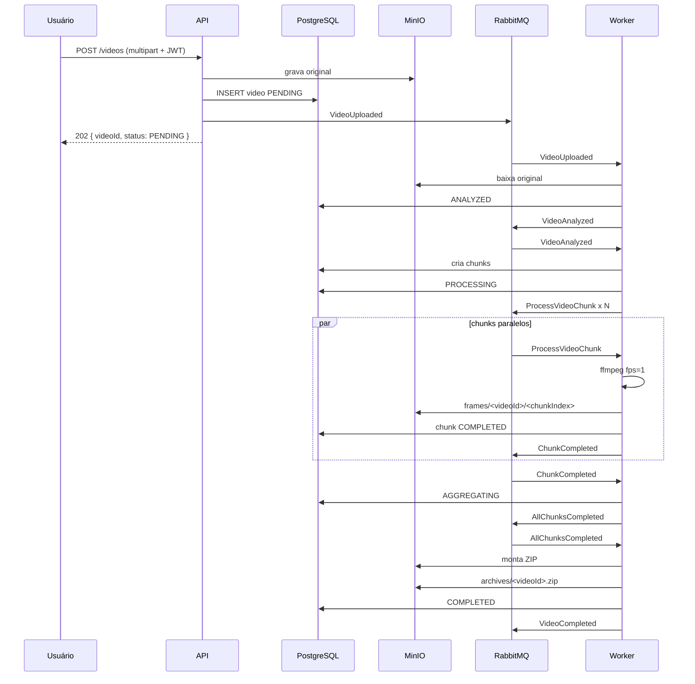

# 05 — Estado atual e revisão de ADRs

Este documento consolida o estado da implementação e revisa os ADRs registrados em
[`docs/02-arquitetura-alvo.md`](02-arquitetura-alvo.md).

## 1. Resumo do que foi implementado

| Fase   | Escopo                                                                           | Status       |
| ------ | -------------------------------------------------------------------------------- | ------------ |
| Fase 0 | Bootstrap NestJS, config, logger, dependency-cruiser, CI, Docker                 | Concluída    |
| Fase 1 | Identidade: VOs, use cases, Postgres/bcrypt/JWT, controller e e2e                | Concluída    |
| Fase 2 | Video-management: upload, listagem, status, download, adapters, controller e web | Concluída    |
| Fase 3 | Video-processing: chunking, análise, processamento, agregação, ZIP e notificação | Concluída    |
| Fase 4 | Resiliência: repescagem, CAS, E2E, cobertura, concorrência e rate limiting       | Concluída    |
| Fase 5 | Observabilidade: métricas, Grafana/Prometheus, health e traceparent              | Concluída    |
| Fase 6 | Entrega: README, schema/seed SQL                                                 | Em andamento |

## 2. Fluxo atual

## 3. Revisão dos ADRs

| ID      | Decisão                                    | Status  | Observação                                                   |
| ------- | ------------------------------------------ | ------- | ------------------------------------------------------------ |
| ADR-001 | TypeScript + NestJS                        | Mantida | Implementação em monorepo TypeScript strict                  |
| ADR-002 | Microsserviços modulares em monorepo       | Mantida | `api`, `worker` e `web` com código de domínio compartilhado  |
| ADR-003 | RabbitMQ em vez de Kafka                   | Mantida | Consumers com retry/backoff/DLQ                              |
| ADR-004 | Object storage em vez de disco local       | Mantida | `S3VideoStorage` e `S3FrameStorage`                          |
| ADR-005 | Chunking por janela de tempo               | Mantida | `ChunkPlan` com nomes determinísticos                        |
| ADR-006 | Transições com `WHERE status = ...`        | Mantida | `VideoRepository.saveTransition` e `PostgresChunkRepository` |
| ADR-007 | Download por URL assinada                  | Mantida | `S3SignedUrlGenerator`                                       |
| ADR-008 | Redis apenas para rate limiting            | Mantida | `RedisRateLimiter` aplicado em login e upload                |
| ADR-009 | Lease com `worker_id` + `locked_until`     | Mantida | `ChunkLease` e `ChunkReaper`                                 |
| ADR-010 | Contexto `notification` com tabela própria | Mantida | `NotifyProcessingFailureUseCase` e `NotificationGateway`     |
| ADR-011 | Imagens Docker separadas                   | Mantida | `api.Dockerfile` sem FFmpeg; `worker.Dockerfile` com FFmpeg  |

Nenhum ADR precisou ser revertido. As pequenas divergências observadas durante a implementação
(por exemplo, transição `ANALYZED -> FAILED` não prevista no diagrama original) foram tratadas
mantendo a máquina de estados documentada.

## 4. Pontos de atenção para a entrega final

- Instrumentar as métricas nos fluxos (`videos_total`, `chunks_total`, `queue_depth`, etc.).
- Completar `HealthService` com checks de RabbitMQ, Redis e S3.
- Evoluir a propagação de `traceparent` para reutilizar o trace recebido no consumer.
- Validar `docker compose --scale worker=3` em ambiente de demonstração.
