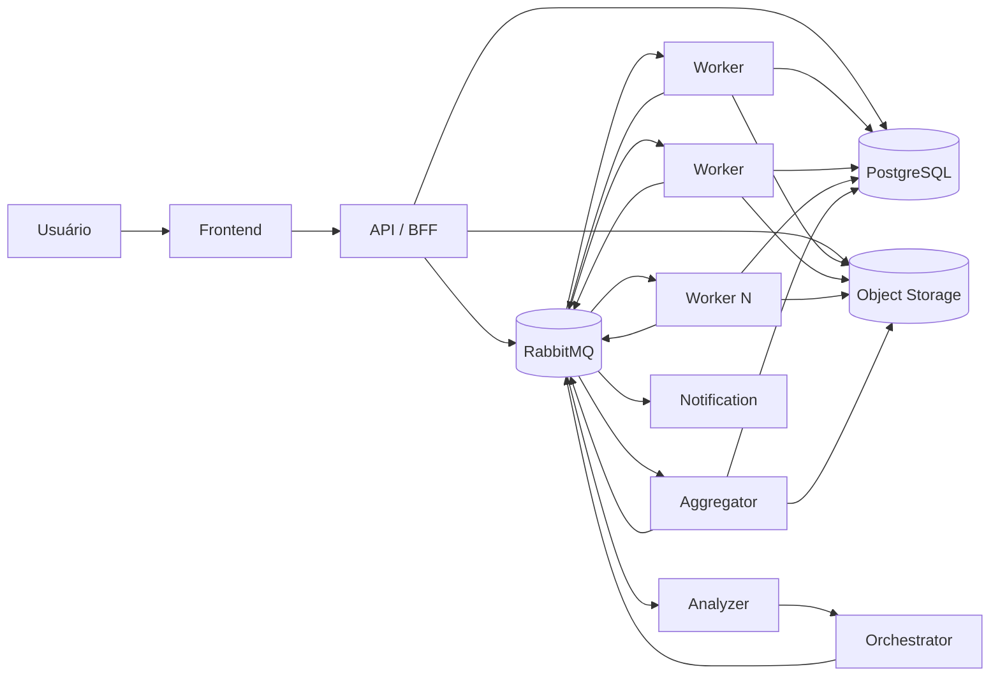
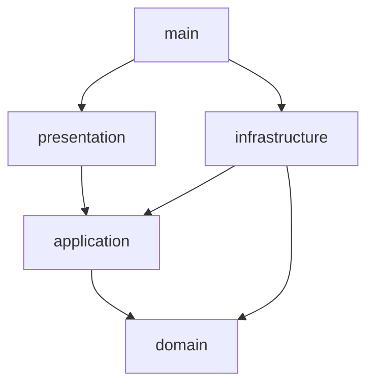
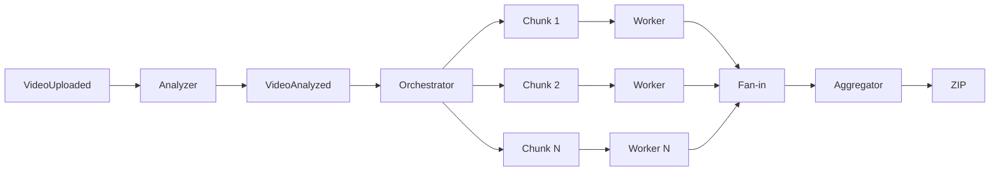

# Arquitetura da Solução

## Visão geral

## Separação de responsabilidades

### API

Responsável por:

- autenticação;
- autorização;
- ownership;
- criação do vídeo;
- emissão de evento;
- consultas;
- download assinado.

Não executa FFmpeg.

### Processor

Contém os entrypoints:

- Analyzer;
- Orchestrator;
- Worker;
- Aggregator.

Cada entrypoint pode escalar independentemente quando necessário.

### Notification

Consome eventos relevantes e chama provider externo.

## Clean Architecture

### Domain

Pode conter:

- entities;
- value objects;
- domain errors;
- policies;
- invariants.

Não pode conhecer:

- NestJS;
- RabbitMQ;
- PostgreSQL;
- ORM;
- FFmpeg;
- storage SDK;
- HTTP.

### Application

Contém:

- use cases;
- ports;
- repository contracts;
- orchestration;
- transaction boundaries.

### Infrastructure

Implementa:

- repositories;
- RabbitMQ publisher/consumer;
- FFmpeg adapter;
- ffprobe adapter;
- Object Storage;
- providers.

### Presentation

Traduz:

- HTTP;
- message transport;
- validation;
- errors.

### Main

Configura:

- DI;
- modules;
- bootstrap;
- config;
- adapters.

## Estratégia de processamento

## Estratégia de escala

Dois níveis:

1. **inter-video concurrency**: múltiplos vídeos simultâneos;
2. **intra-video concurrency**: múltiplos chunks de um mesmo vídeo.

## Garantias mínimas

- at-least-once delivery;
- idempotência;
- retry;
- DLQ;
- atomicidade em estados concorrentes;
- storage externo;
- logs correlacionáveis.
