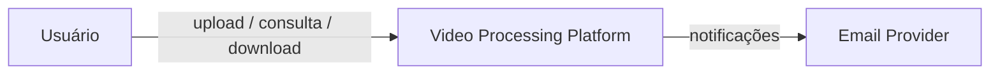
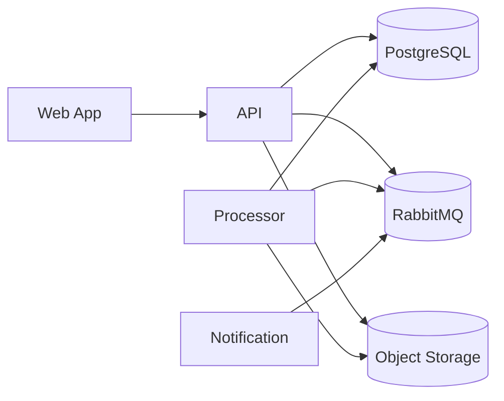
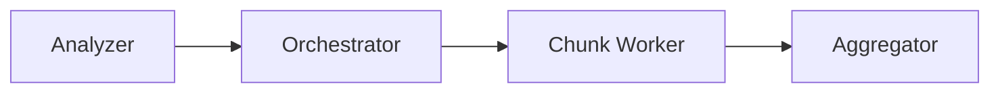

# C4 Model

## C1 — System Context

```mermaid
flowchart LR
    U[Usuário]
    SYS[Video Processing Platform]
    MAIL[Email Provider]

    U -->|upload / consulta / download| SYS
    SYS -->|notificações| MAIL
```

## C2 — Containers

```mermaid
flowchart LR
    WEB[Web App]
    API[API]
    PROC[Processor]
    NOTIF[Notification]
    DB[(PostgreSQL)]
    MQ[(RabbitMQ)]
    STORAGE[(Object Storage)]

    WEB --> API
    API --> DB
    API --> MQ
    API --> STORAGE

    PROC --> DB
    PROC --> MQ
    PROC --> STORAGE

    NOTIF --> MQ
```

## C3 — Processor

```mermaid
flowchart LR
    ANA[Analyzer]
    ORC[Orchestrator]
    WRK[Chunk Worker]
    AGG[Aggregator]

    ANA --> ORC
    ORC --> WRK
    WRK --> AGG
```
