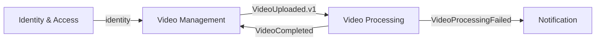

# Context Map

## Identity & Access

Responsabilidades:

- User;
- authentication;
- token/session;
- ownership identity.

## Video Management

Responsabilidades:

- Video;
- upload lifecycle;
- status público;
- listagem;
- download.

## Video Processing

Responsabilidades:

- analysis;
- chunking;
- processing;
- retries;
- aggregation.

## Notification

Responsabilidades:

- comunicação com usuário;
- templates;
- provider.

## Regras de integração

- contexto não importa `domain`, `application`, `infrastructure` ou `presentation` de outro contexto;
- preferir eventos, comandos, queries e IDs;
- contratos públicos pertencem ao contexto provedor;
- `main` apenas compõe dependências.
