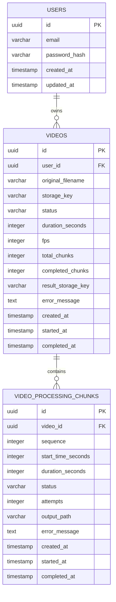

# Modelo de Dados

## ER



## Status de Video

```text
PENDING
ANALYZING
PROCESSING
AGGREGATING
COMPLETED
FAILED
```

## Status de Chunk

```text
PENDING
PROCESSING
COMPLETED
FAILED
```

## Regras

- `UNIQUE(video_id, sequence)`;
- `completed_chunks <= total_chunks`;
- um chunk completo não pode ser processado novamente;
- agregação requer todos os chunks completos;
- apenas uma execução pode promover `PROCESSING -> AGGREGATING`.
