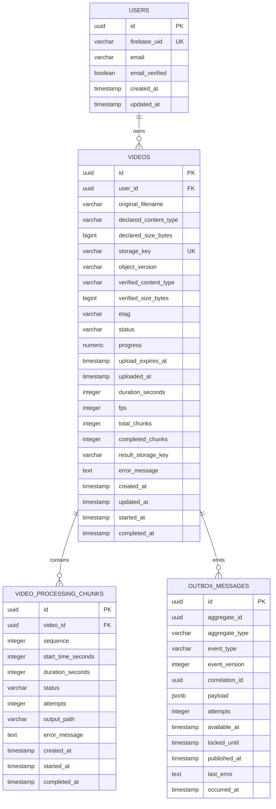

# Modelo de Dados

## ER



## Status de Video

```text
AWAITING_UPLOAD
PENDING
ANALYZING
PROCESSING
AGGREGATING
COMPLETED
FAILED
```

EPIC-003 entrega `AWAITING_UPLOAD -> PENDING`. Os épicos seguintes adicionam as demais transições sem redefinir o significado dos estados existentes.

## Status de Chunk

```text
PENDING
PROCESSING
COMPLETED
FAILED
```

## Regras

- `users.firebase_uid` é obrigatório e único;
- `users.email` pode ser nulo e possui índice único parcial quando preenchido;
- a aplicação não persiste senha ou Firebase ID Token;
- `videos.user_id` referencia o `UserId` interno, nunca `firebase_uid`;
- `videos.storage_key` é determinística e única;
- metadata verificada e `uploaded_at` são nulos em `AWAITING_UPLOAD` e obrigatórios a partir de `PENDING`;
- `progress` é nulo quando indisponível e, quando preenchido, permanece entre 0 e 100;
- índice `(user_id, created_at DESC, id DESC)` sustenta listagem keyset;
- único `(aggregate_id, event_type, event_version)` impede duas intenções `VideoUploaded.v1`;
- outbox publicado somente após publisher confirm;
- `UNIQUE(video_id, sequence)`;
- `completed_chunks <= total_chunks`;
- um chunk completo não pode ser processado novamente;
- agregação requer todos os chunks completos;
- apenas uma execução pode promover `PROCESSING -> AGGREGATING`.
