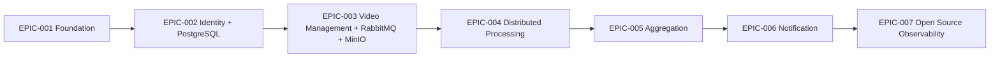

# Roadmap

## Capability placement

- EPIC-001 entrega core arquitetural, testes, CI/CD e imagem da API;
- EPIC-002 introduz PostgreSQL para persistência de identidade;
- EPIC-003 introduz RabbitMQ e MinIO para o fluxo de vídeos;
- EPIC-007 implementa prioritariamente logs, métricas e tracing com uma suíte open source.

Testabilidade e segurança são consideradas desde o primeiro épico. A instrumentação completa de observabilidade é deliberadamente adiada para o EPIC-007.
