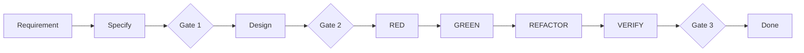

# Spec-Driven Development + Phase Gates

## Regra

O projeto usa:

- **phase-gated SDD** como processo;
- **Gherkin** somente para comportamento observável;
- **TDD** para novo comportamento.

## Fluxo



## Gate 1 — Ready for Design

Obrigatório:

- objetivo;
- escopo;
- out-of-scope;
- requisitos;
- riscos;
- ambiguidades relevantes identificadas.

## Gate 2 — Ready for Development

Obrigatório:

- `spec.md`;
- `requirements.md`;
- `design.md`;
- critérios de aceite;
- contratos conhecidos;
- ADRs aplicáveis;
- estratégia de testes;
- impacto de segurança;
- impacto de concorrência.

## Gate 3 — Done

Obrigatório:

- acceptance completo;
- testes;
- coverage >= 80%;
- lint;
- typecheck;
- build;
- docs atualizados.

## Gherkin

Bom:

```gherkin
Scenario: usuário tenta acessar vídeo de outro usuário
  Given que o usuário está autenticado
  And o vídeo pertence a outro usuário
  When ele consulta o vídeo
  Then o acesso deve ser negado
```

Ruim:

```gherkin
Scenario: clean architecture
  Given domain
  When infrastructure
  Then dependencies point inward
```

Arquitetura deve ser expressa como requisito arquitetural, não como cenário de negócio.
