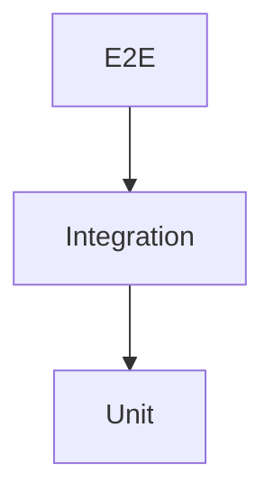

# Estratégia de Testes

## TDD

```text
RED -> GREEN -> REFACTOR
```

## Pirâmide



## Unit

Prioridade máxima.

Cobrir:

- domain rules;
- value objects;
- use cases;
- chunk calculation;
- transitions;
- ownership;
- idempotency;
- progress;
- error behavior.

Sem infra real.

## Integration

Cobrir adapters:

- PostgreSQL;
- RabbitMQ;
- Object Storage;
- ffprobe/FFmpeg wrapper.

## E2E

Cobrir fluxos essenciais:

```text
register/login
upload
processing
status
aggregation
download
failure/retry
```

## Coverage

```text
lines      >= 80%
statements >= 80%
functions  >= 80%
branches   >= 80%
```

Cobertura é gate, não objetivo de teste.
