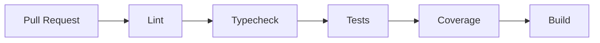
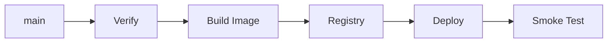

# CI/CD

## CI

```mermaid
flowchart LR
    PR[Pull Request] --> L[Lint]
    L --> T[Typecheck]
    T --> TEST[Tests]
    TEST --> COV[Coverage]
    COV --> B[Build]
```

Pipeline falha quando:

- lint falha;
- typecheck falha;
- teste falha;
- coverage < 80%;
- build falha.

## CD

```mermaid
flowchart LR
    MAIN[main] --> V[Verify]
    V --> IMG[Build Image]
    IMG --> REG[Registry]
    REG --> DEPLOY[Deploy]
    DEPLOY --> SMOKE[Smoke Test]
```
