# FIAP X — Estratégia Técnica e Arquitetura de Processamento Distribuído de Vídeos

> Documento de arquitetura e implementação para o Hackathon — Sistema de Processamento de Vídeos.
>
> **Base do desafio:** evoluir o projeto existente, que recebe um vídeo, extrai imagens e gera um arquivo `.zip`, para uma solução autenticada, persistente, escalável, resiliente e observável.
>
> **Observação importante:** os requisitos funcionais e técnicos abaixo foram extraídos do enunciado do Hackathon. A decomposição arquitetural, os microsserviços, contratos, diagramas, estratégia de chunking, filas, banco e práticas operacionais são uma **proposta de implementação**.

---

# 1. Objetivo da solução

A solução deve permitir que um usuário autenticado:

1. envie um vídeo;
2. acompanhe o status do processamento;
3. tenha o vídeo processado de forma assíncrona;
4. tenha os frames extraídos em paralelo quando isso for vantajoso;
5. receba um arquivo ZIP consolidado com as imagens;
6. faça download do resultado;
7. seja notificado em caso de falha.

Além disso, a plataforma deve:

- processar múltiplos vídeos ao mesmo tempo;
- não perder requisições em picos;
- persistir dados;
- permitir escala horizontal;
- possuir testes;
- possuir CI/CD;
- possuir observabilidade.

---

# 2. Princípios arquiteturais

## 2.1 Separação entre ingestão e processamento

A API não deve executar o processamento do vídeo dentro da requisição HTTP.

Fluxo desejado:

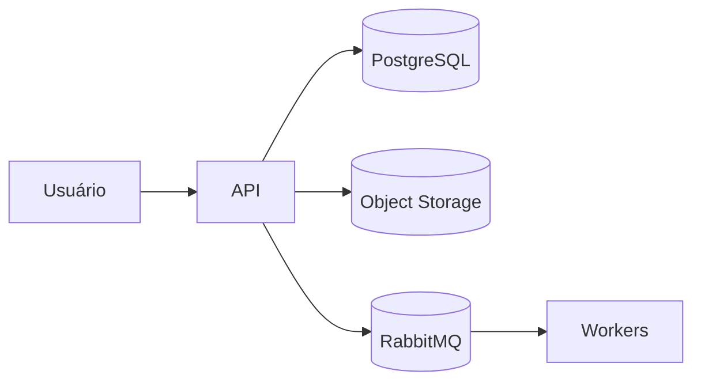

A API deve retornar rapidamente, normalmente com:

```http
202 Accepted
```

Exemplo:

```json
{
  "videoId": "7bcd0f52-7d39-4de2-b498-b3fe6cc2405e",
  "status": "PENDING"
}
```

---

## 2.2 Processamento assíncrono

O processamento pesado é executado fora da API.

Responsabilidades típicas do worker:

- acessar o vídeo;
- executar FFmpeg;
- extrair frames;
- armazenar resultados intermediários;
- atualizar progresso;
- emitir eventos.

---

## 2.3 Paralelismo em dois níveis

A arquitetura suporta dois tipos diferentes de concorrência.

### Paralelismo entre vídeos

```text
Video A → Worker
Video B → Worker
Video C → Worker
```

### Paralelismo dentro de um vídeo

```text
Video A
 ├── chunk 1 → Worker
 ├── chunk 2 → Worker
 ├── chunk 3 → Worker
 └── chunk 4 → Worker
```

Isso permite escalar tanto o **throughput global** quanto o **tempo de processamento de um vídeo individual**.

---

# 3. Arquitetura de alto nível

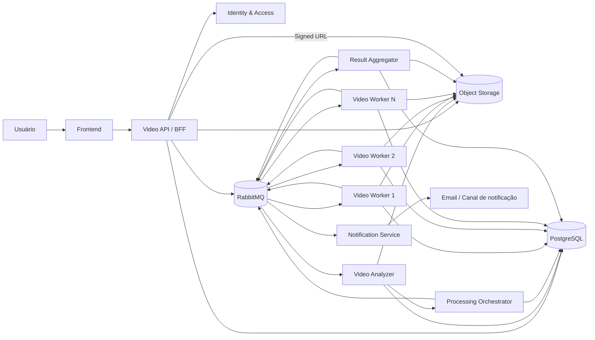

---

# 4. Componentes da solução

## 4.1 Frontend

Responsabilidades:

- cadastro;
- login;
- upload;
- listagem de vídeos;
- acompanhamento de status;
- apresentação de erros;
- download do resultado.

Fluxo:

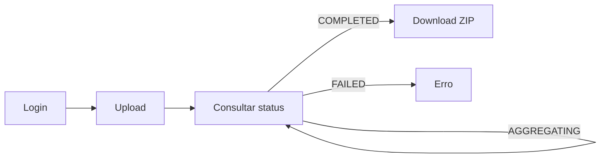

O frontend não conhece detalhes de chunks ou workers.

---

# 5. Video API / BFF

Responsabilidades:

- autenticação;
- autorização;
- ownership;
- criação do registro do vídeo;
- emissão do evento de upload concluído;
- consulta de status;
- entrega do link de download.

Endpoints sugeridos:

```text
POST /auth/register
POST /auth/login

POST /videos
POST /videos/:videoId/upload-completed

GET  /videos
GET  /videos/:videoId
GET  /videos/:videoId/download
```

---

## 5.1 Estratégia de upload

Para arquivos grandes, o upload direto para storage é preferível.

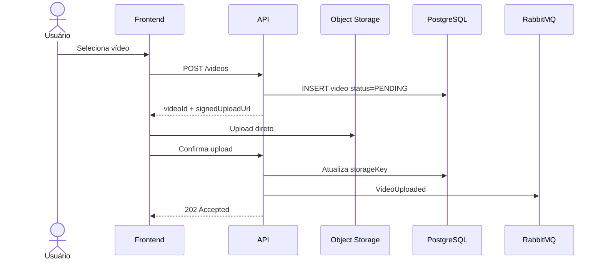

Vantagens:

- reduz tráfego da API;
- diminui uso de memória;
- melhora escalabilidade;
- evita timeout HTTP.

---

# 6. Identity & Access

Estratégia mínima para o desafio:

```text
email + senha
JWT
```

Modelo:

```sql
users
-----
id UUID PK
email VARCHAR UNIQUE
password_hash VARCHAR
created_at TIMESTAMP
updated_at TIMESTAMP
```

Regra:

```text
video.user_id == authenticated_user.id
```

Não há necessidade inicial de RBAC complexo.

---

# 7. Ciclo de vida do vídeo

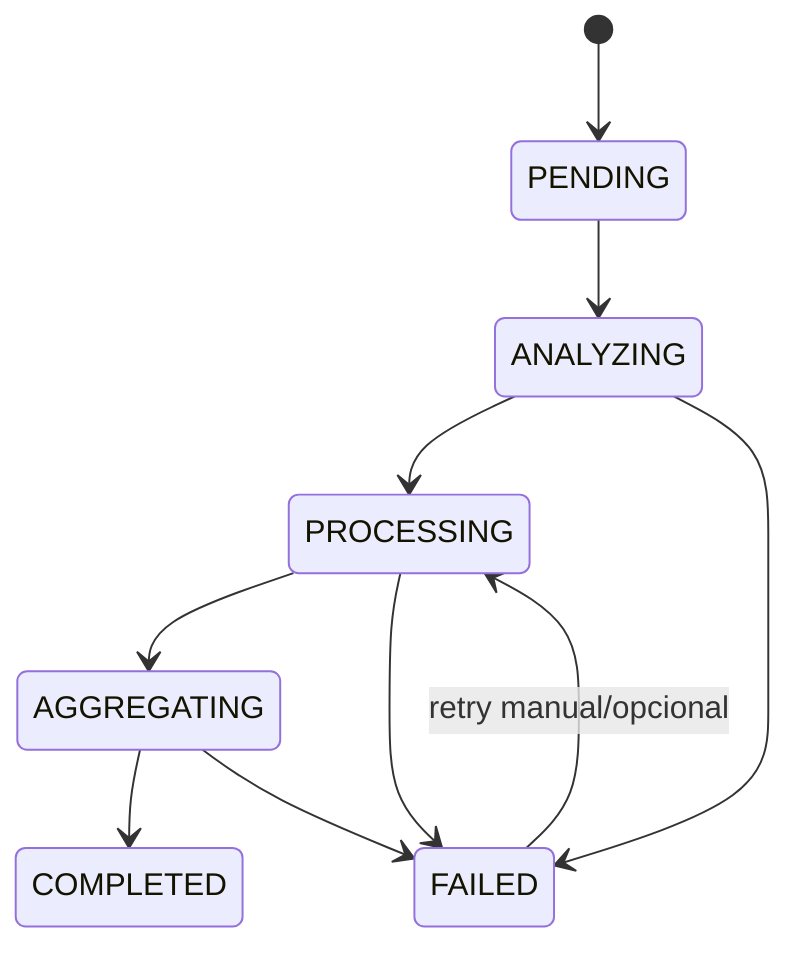

Estados:

| Status | Significado |
|---|---|
| `PENDING` | upload concluído, aguardando processamento |
| `ANALYZING` | metadados sendo analisados |
| `PROCESSING` | chunks sendo executados |
| `AGGREGATING` | resultados sendo consolidados |
| `COMPLETED` | ZIP disponível |
| `FAILED` | processamento encerrado com erro |

---

# 8. Video Analyzer

Antes do processamento, o vídeo deve ser analisado.

Ferramenta:

```bash
ffprobe -v quiet \
  -print_format json \
  -show_format \
  -show_streams \
  video.mp4
```

Metadados esperados:

```json
{
  "duration": 1834,
  "fps": 30,
  "width": 1920,
  "height": 1080,
  "codec": "h264",
  "bitrate": 8500000
}
```

Esses dados alimentam a estratégia de chunking.

---

# 9. Estratégia de chunking

## 9.1 Divisão lógica

O vídeo não precisa ser dividido fisicamente.

Exemplo:

```text
Vídeo = 10 minutos

chunk 1 = 00:00 → 02:00
chunk 2 = 02:00 → 04:00
chunk 3 = 04:00 → 06:00
chunk 4 = 06:00 → 08:00
chunk 5 = 08:00 → 10:00
```

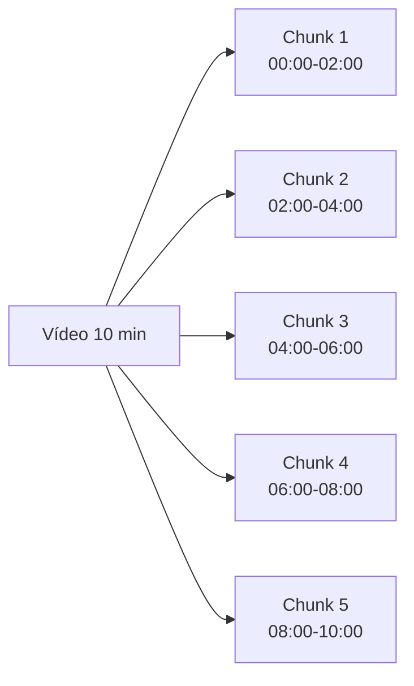

---

## 9.2 Contrato do job

```json
{
  "jobId": "uuid",
  "videoId": "uuid",
  "chunkId": "uuid",
  "sequence": 3,
  "startTimeSeconds": 240,
  "durationSeconds": 120,
  "storageKey": "videos/abc/original.mp4"
}
```

---

## 9.3 Exemplo de processamento

```bash
ffmpeg \
  -ss 240 \
  -i video.mp4 \
  -t 120 \
  -vf "fps=1" \
  frames/chunk-003/frame-%06d.jpg
```

---

# 10. Estratégia dinâmica de chunking

Evitar regra fixa para todos os vídeos.

Proposta inicial:

| Duração | Estratégia |
|---|---|
| < 2 min | 1 chunk |
| 2–10 min | chunks de 2 min |
| 10–30 min | chunks de 5 min |
| > 30 min | chunks de 5–10 min |

A decisão final deve ser baseada em benchmark.

Pseudo-regra:

```text
if duration < 120:
    chunkSize = duration

elif duration <= 600:
    chunkSize = 120

elif duration <= 1800:
    chunkSize = 300

else:
    chunkSize = 600
```

---

# 11. Orchestrator

Responsabilidades:

- calcular chunks;
- persistir chunks;
- publicar jobs;
- acompanhar progresso;
- iniciar agregação.

Fluxo:

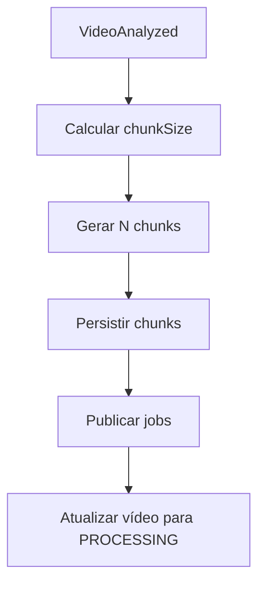

---

# 12. Fan-out

O Orchestrator transforma um vídeo em N jobs.

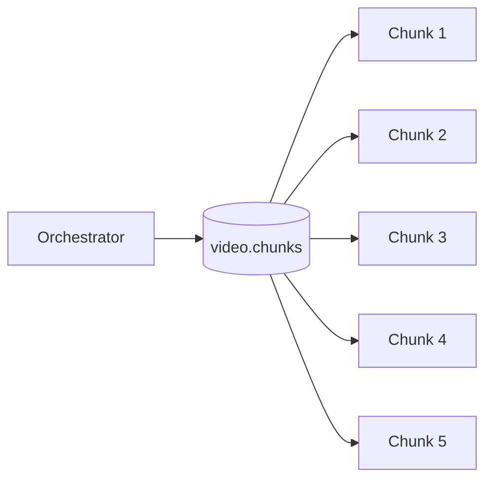

---

# 13. Video Workers

Workers são stateless e horizontalmente escaláveis.

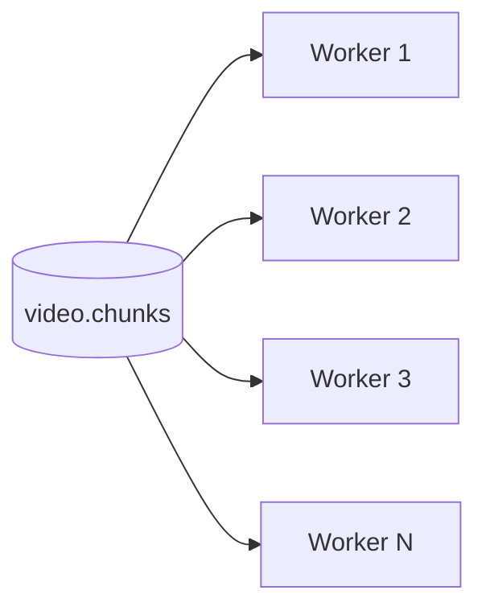

Cada worker:

1. recebe um job;
2. verifica idempotência;
3. marca chunk como `PROCESSING`;
4. obtém o vídeo;
5. executa FFmpeg;
6. salva frames;
7. marca chunk como `COMPLETED`;
8. publica `ChunkCompleted`.

---

# 14. Idempotência

RabbitMQ pode redeliver uma mensagem.

Logo:

```text
mesmo job pode chegar >1 vez
```

Regra:

```text
se chunk.status == COMPLETED:
    ACK
    return
```

Também é recomendável usar caminhos determinísticos:

```text
frames/{videoId}/{chunkSequence}/frame-000001.jpg
```

e não:

```text
frames/random-uuid.jpg
```

Assim o reprocessamento não cria artefatos duplicados.

---

# 15. Concorrência

Configuração:

```env
WORKER_CONCURRENCY=4
```

Exemplo:

```text
6 chunks
4 slots

t0
worker1 → chunk1
worker2 → chunk2
worker3 → chunk3
worker4 → chunk4

t1
worker1 → chunk5
worker3 → chunk6
```

---

# 16. Escalabilidade horizontal

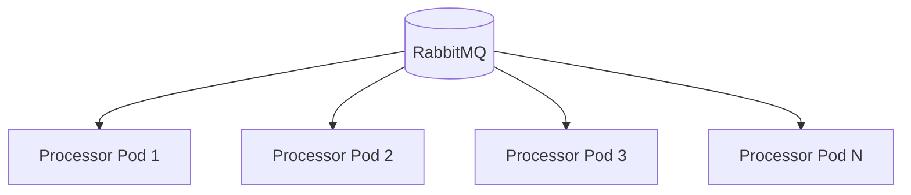

O número de processors pode aumentar conforme:

- profundidade da fila;
- CPU;
- tempo médio de processamento;
- quantidade de vídeos aguardando.

---

# 17. Fan-in e Aggregator

Depois de executar os chunks, é necessário consolidar os resultados.

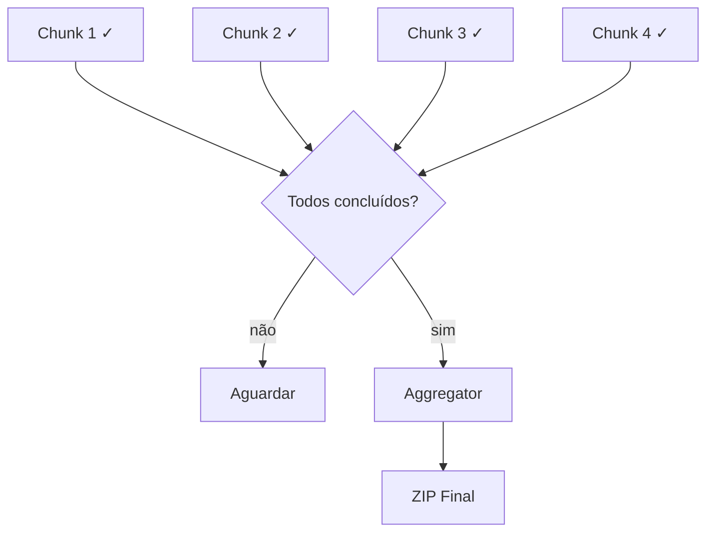

Critério:

```text
completed_chunks == total_chunks
```

ou query equivalente.

---

# 18. Estratégia de armazenamento dos frames

Estrutura:

```text
videos/
  {videoId}/
    original.mp4

frames/
  {videoId}/
    chunk-0001/
      frame-000001.jpg
      frame-000002.jpg

    chunk-0002/
      frame-000001.jpg

results/
  {videoId}/
    frames.zip
```

---

# 19. Geração do ZIP

O Aggregator:

1. identifica chunks completos;
2. reúne seus outputs;
3. garante ordenação;
4. gera o ZIP;
5. envia o ZIP ao storage;
6. atualiza vídeo;
7. publica `VideoCompleted`.

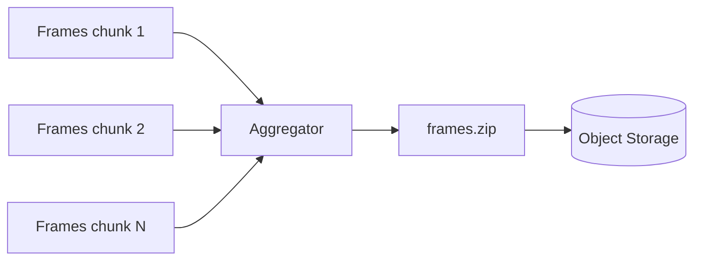

---

# 20. Otimização futura do ZIP

Para vídeos muito grandes, baixar todos os frames em um único worker pode virar gargalo.

Alternativas:

### Estratégia A — ZIP único

Mais simples.

```text
frames → Aggregator → final.zip
```

### Estratégia B — ZIP por chunk

```text
chunk1 → part-01.zip
chunk2 → part-02.zip
chunk3 → part-03.zip
```

### Estratégia C — streaming

Criar ZIP usando streams, evitando carregar todos os arquivos em memória.

Para o Hackathon, **A + streaming** oferece melhor equilíbrio entre simplicidade e qualidade.

---

# 21. Mensageria

RabbitMQ é utilizado como backbone do processamento.

Filas sugeridas:

```text
video.analysis
video.chunks
video.aggregation
video.notifications

video.analysis.retry
video.chunks.retry
video.aggregation.retry

video.analysis.dlq
video.chunks.dlq
video.aggregation.dlq
```

---

# 22. Fluxo das filas

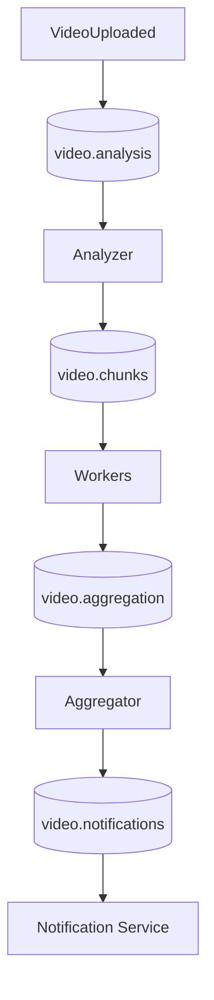

---

# 23. Retry

Falha transitória:

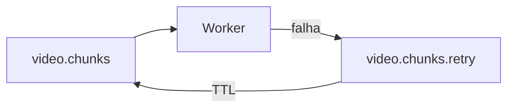

Exemplo:

```text
attempt 1
↓
30 segundos

attempt 2
↓
2 minutos

attempt 3
↓
10 minutos
```

---

# 24. Dead Letter Queue

Após exceder o limite:


Nesse momento:

```text
chunk.status = FAILED
video.status = FAILED
```

e um evento é emitido.

---

# 25. Modelo de dados

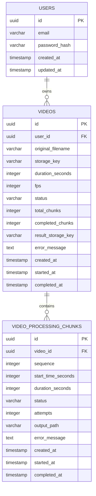

---

# 26. Tabela `videos`

```sql
CREATE TABLE videos (
    id UUID PRIMARY KEY,
    user_id UUID NOT NULL REFERENCES users(id),

    original_filename VARCHAR(255) NOT NULL,
    storage_key VARCHAR(500) NOT NULL,

    duration_seconds INTEGER,
    fps INTEGER,

    status VARCHAR(30) NOT NULL,

    total_chunks INTEGER NOT NULL DEFAULT 0,
    completed_chunks INTEGER NOT NULL DEFAULT 0,

    result_storage_key VARCHAR(500),
    error_message TEXT,

    created_at TIMESTAMP NOT NULL DEFAULT NOW(),
    started_at TIMESTAMP,
    completed_at TIMESTAMP
);
```

---

# 27. Tabela `video_processing_chunks`

```sql
CREATE TABLE video_processing_chunks (
    id UUID PRIMARY KEY,
    video_id UUID NOT NULL REFERENCES videos(id),

    sequence INTEGER NOT NULL,
    start_time_seconds INTEGER NOT NULL,
    duration_seconds INTEGER NOT NULL,

    status VARCHAR(30) NOT NULL,
    attempts INTEGER NOT NULL DEFAULT 0,

    output_path VARCHAR(500),
    error_message TEXT,

    created_at TIMESTAMP NOT NULL DEFAULT NOW(),
    started_at TIMESTAMP,
    completed_at TIMESTAMP,

    UNIQUE(video_id, sequence)
);
```

---

# 28. Contratos de eventos

## VideoUploaded

```json
{
  "eventId": "uuid",
  "eventType": "VideoUploaded",
  "occurredAt": "2026-09-26T13:00:00Z",
  "videoId": "uuid",
  "storageKey": "videos/uuid/original.mp4"
}
```

## VideoAnalyzed

```json
{
  "eventId": "uuid",
  "eventType": "VideoAnalyzed",
  "videoId": "uuid",
  "durationSeconds": 600,
  "fps": 30
}
```

## ProcessVideoChunk

```json
{
  "eventId": "uuid",
  "eventType": "ProcessVideoChunk",
  "videoId": "uuid",
  "chunkId": "uuid",
  "sequence": 3,
  "startTimeSeconds": 240,
  "durationSeconds": 120
}
```

## ChunkCompleted

```json
{
  "eventId": "uuid",
  "eventType": "ChunkCompleted",
  "videoId": "uuid",
  "chunkId": "uuid",
  "sequence": 3
}
```

## VideoCompleted

```json
{
  "eventId": "uuid",
  "eventType": "VideoCompleted",
  "videoId": "uuid",
  "resultStorageKey": "results/uuid/frames.zip"
}
```

---

# 29. Fluxo completo

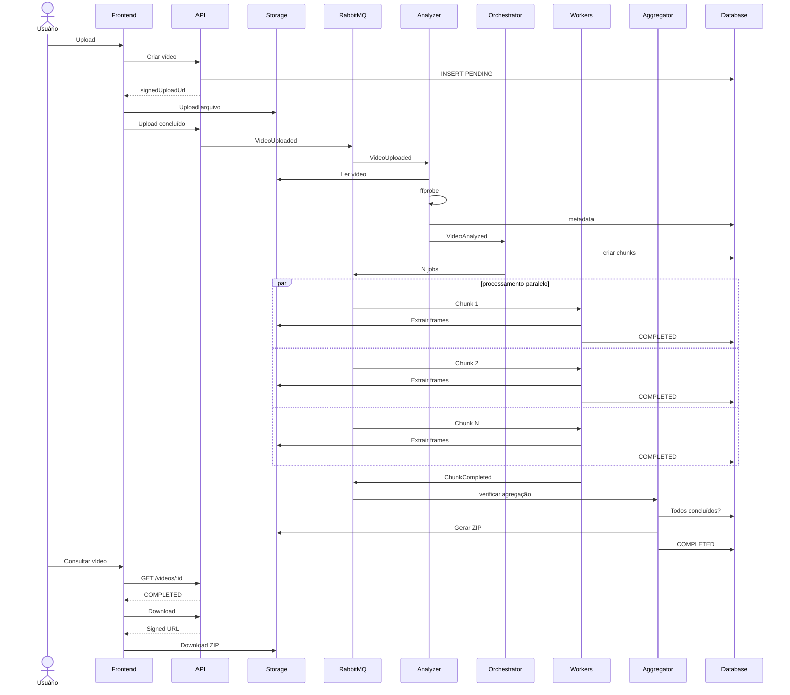

---

# 30. Fluxo de falha

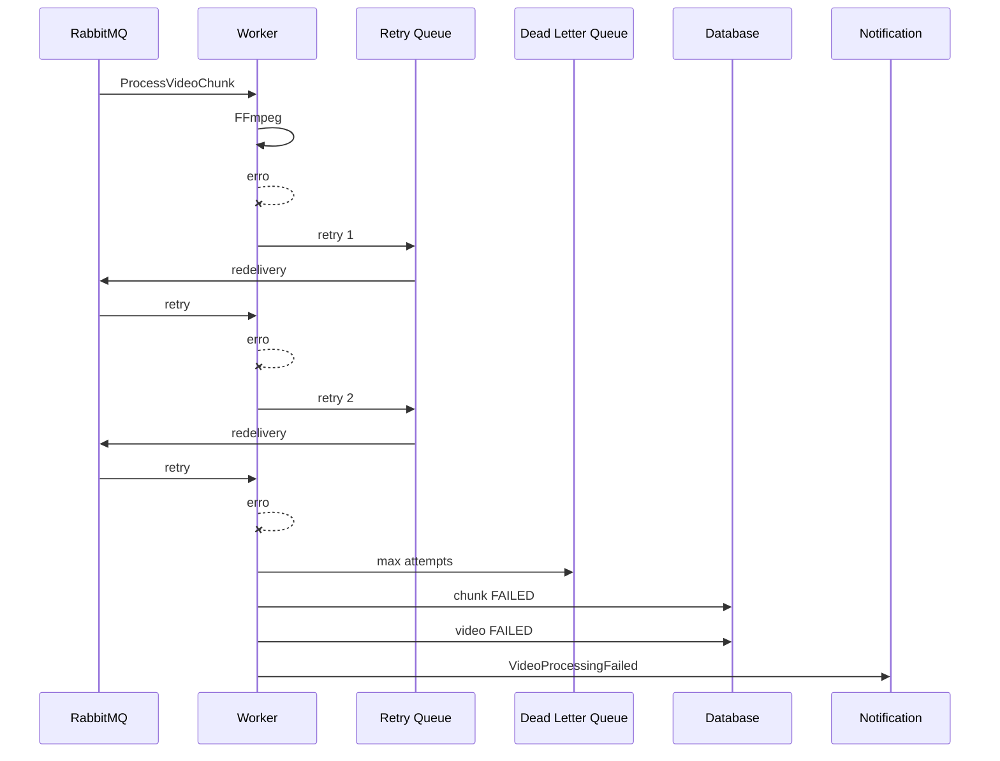

---

# 31. Observabilidade

## Logs estruturados

Campos mínimos:

```json
{
  "timestamp": "...",
  "level": "INFO",
  "service": "video-processor",
  "correlationId": "...",
  "videoId": "...",
  "chunkId": "...",
  "messageId": "...",
  "message": "Chunk completed"
}
```

---

# 32. Métricas

Prometheus:

```text
videos_received_total
videos_completed_total
videos_failed_total

chunks_processed_total
chunks_failed_total

video_processing_duration_seconds
chunk_processing_duration_seconds

queue_depth
worker_active_jobs
worker_processing_seconds

zip_generation_duration_seconds
```

---

# 33. Dashboard

Grafana pode apresentar:

```text
Vídeos recebidos/min
Vídeos processados/min
Taxa de erro
Tempo médio por vídeo
Tempo médio por chunk
Tamanho médio da fila
Workers ativos
CPU
Memória
```

---

# 34. Distributed tracing

Opcional, porém recomendado:

```text
OpenTelemetry
```

Fluxo:

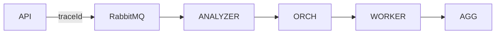

O `traceId` deve ser propagado nas mensagens.

---

# 35. Estratégia de performance

O principal objetivo é identificar o ponto onde o paralelismo deixa de gerar ganho.

Benchmark:

```text
1 worker
2 workers
4 workers
8 workers
```

Medir:

- tempo total;
- CPU;
- memória;
- throughput do storage;
- quantidade de jobs;
- tempo médio por chunk;
- overhead de inicialização do FFmpeg.

---

# 36. Hipótese de benchmark

Exemplo ilustrativo:

```text
Vídeo: 30 minutos
Frames: 1 frame/s
Chunks: 6 × 5 minutos

1 worker → baseline
2 workers → ganho esperado
4 workers → ganho maior
8 workers → possível saturação de CPU/I/O
```

O objetivo não é assumir escala linear.

---

# 37. Critério de chunk ideal

Chunks muito pequenos:

```text
+ paralelismo
- overhead RabbitMQ
- overhead FFmpeg
- mais arquivos
- mais operações no banco
```

Chunks muito grandes:

```text
+ menos overhead
- menos paralelismo
- retry mais caro
```

Portanto existe um ponto ótimo.

---

# 38. Limite de concorrência

Evitar:

```text
50 chunks
50 FFmpeg simultâneos
```

Uma máquina pode rapidamente saturar.

Usar:

```env
PROCESSOR_CONCURRENCY=4
```

e escalar a quantidade de instâncias.

---

# 39. Escala orientada por fila

Melhor indicador:

```text
queue depth
```

Exemplo conceitual:

```text
0–10 jobs  → 1 processor
11–30      → 2 processors
31–60      → 4 processors
>60        → escalar
```

No Kubernetes, isso pode evoluir para KEDA ou outra estratégia baseada em RabbitMQ.

---

# 40. Cache

Redis é opcional.

Possíveis usos:

- status de processamento;
- locks distribuídos;
- rate limiting;
- counters temporários.

Não é obrigatório se PostgreSQL + RabbitMQ já resolverem o escopo.

---

# 41. Segurança

Pontos mínimos:

- senhas com hash seguro;
- JWT com expiração;
- secrets fora do repositório;
- upload limitado por tipo/tamanho;
- validação MIME;
- autorização por ownership;
- URLs assinadas com expiração;
- storage privado;
- RabbitMQ não exposto publicamente;
- banco não exposto publicamente.

---

# 42. API — exemplos

## Criar vídeo

```http
POST /videos
Authorization: Bearer <token>
```

Resposta:

```json
{
  "id": "uuid",
  "status": "PENDING",
  "uploadUrl": "https://..."
}
```

## Listar vídeos

```http
GET /videos
Authorization: Bearer <token>
```

Resposta:

```json
[
  {
    "id": "uuid",
    "filename": "video.mp4",
    "status": "PROCESSING",
    "progress": 67
  }
]
```

## Consultar vídeo

```http
GET /videos/:id
```

## Download

```http
GET /videos/:id/download
```

Resposta:

```json
{
  "downloadUrl": "https://...",
  "expiresIn": 300
}
```

---

# 43. Cálculo de progresso

Se:

```text
total_chunks = 6
completed_chunks = 4
```

então:

```text
progress = completed_chunks / total_chunks * 100
```

Resultado:

```text
66.67%
```

---

# 44. Atomicidade do progresso

Evitar:

```text
read completed_chunks
+1
save
```

quando múltiplos workers executam em paralelo.

Preferir operação atômica:

```sql
UPDATE videos
SET completed_chunks = completed_chunks + 1
WHERE id = :video_id;
```

---

# 45. Condição de corrida no fan-in

Dois workers podem terminar quase simultaneamente.

Errado:

```text
worker A → "sou o último"
worker B → "sou o último"
```

Isso pode gerar dois ZIPs.

Estratégias:

- unique constraint para aggregation job;
- optimistic locking;
- advisory lock no PostgreSQL;
- estado `AGGREGATING` atualizado atomicamente.

Exemplo:

```sql
UPDATE videos
SET status = 'AGGREGATING'
WHERE id = :video_id
  AND completed_chunks = total_chunks
  AND status = 'PROCESSING';
```

Somente quem alterar uma linha dispara o aggregator.

---

# 46. Estrutura de serviços

Proposta pragmática:

```text
fiapx-web

fiapx-api

fiapx-video-processing
    analyzer
    orchestrator
    worker
    aggregator

fiapx-notification
```

Não é necessário criar um microsserviço separado para cada classe lógica.

O `fiapx-video-processing` pode possuir múltiplos entrypoints.

---

# 47. Estrutura de repositórios

Opção monorepo:

```text
fiapx/
├── apps/
│   ├── web/
│   ├── api/
│   ├── processor/
│   └── notification/
│
├── packages/
│   ├── contracts/
│   ├── observability/
│   └── shared/
│
├── infrastructure/
│   ├── docker/
│   ├── kubernetes/
│   └── monitoring/
│
└── docs/
```

Para um Hackathon, essa abordagem tende a reduzir overhead de gestão.

---

# 48. Arquitetura interna

Sugestão:

```text
src/
├── domain/
├── application/
├── infrastructure/
├── presentation/
└── main/
```

Dependências:

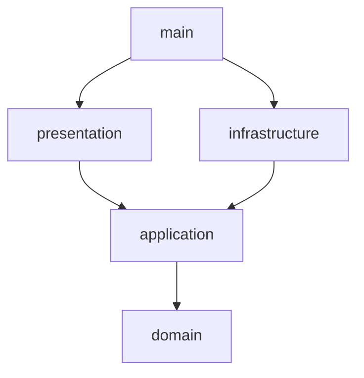

---

# 49. Docker Compose

Ambiente local:

```mermaid
flowchart LR
    API[API]
    PROC[Processor]
    NOT[Notification]
    DB[(PostgreSQL)]
    MQ[(RabbitMQ)]
    MINIO[(MinIO)]
    PROM[Prometheus]
    GRAF[Grafana]

    API --> DB
    API --> MQ
    API --> MINIO

    PROC --> DB
    PROC --> MQ
    PROC --> MINIO

    NOT --> MQ

    PROM --> API
    PROM --> PROC
    GRAF --> PROM
```

---

# 50. Kubernetes

Evolução:

```mermaid
flowchart TD
    ING[Ingress]
    API[API Deployment]
    PROC[Processor Deployment]
    NOT[Notification Deployment]

    ING --> API

    API --> DB[(PostgreSQL)]
    API --> MQ[(RabbitMQ)]
    API --> S[(Object Storage)]

    PROC --> MQ
    PROC --> DB
    PROC --> S

    NOT --> MQ
```

Principal alvo de escala:

```text
Processor Deployment
```

---

# 51. CI

Pipeline:

```mermaid
flowchart LR
    PR[Pull Request]
    PR --> L[Lint]
    L --> U[Unit Tests]
    U --> I[Integration Tests]
    I --> B[Build]
    B --> IMG[Docker Build]
```

---

# 52. CD

```mermaid
flowchart LR
    MAIN[Merge main]
    MAIN --> TEST[Testes]
    TEST --> BUILD[Build image]
    BUILD --> REG[Container Registry]
    REG --> DEPLOY[Deploy]
    DEPLOY --> SMOKE[Smoke tests]
```

---

# 53. Estratégia de testes

## Unitários

Testar:

- cálculo de chunks;
- transições de status;
- regras de ownership;
- cálculo de progresso;
- retry policy.

## Integração

Testar:

- PostgreSQL;
- RabbitMQ;
- storage;
- publicação/consumo.

## E2E

```mermaid
flowchart LR
    L[Login]
    L --> U[Upload]
    U --> P[Processamento]
    P --> C[COMPLETED]
    C --> D[Download]
```

---

# 54. Cenários críticos de teste

### Processamento normal

```text
upload
→ analysis
→ chunking
→ processing
→ aggregation
→ completed
```

### Falha de um chunk

```text
chunk 3
→ failed
→ retry
→ completed
```

### Falha definitiva

```text
chunk
→ retry 1
→ retry 2
→ retry 3
→ DLQ
→ video FAILED
```

### Redelivery

```text
ChunkCompleted já persistido
→ mensagem novamente
→ worker identifica idempotência
→ ACK
```

### Concorrência

```text
100 vídeos
→ fila
→ workers limitados
→ nenhum job perdido
```

---

# 55. Epics de implementação

## EPIC 01 — Foundation & Architecture

- Docker;
- PostgreSQL;
- RabbitMQ;
- Object Storage;
- estrutura de projeto;
- documentação arquitetural.

## EPIC 02 — Identity & Access

- cadastro;
- login;
- JWT;
- ownership.

## EPIC 03 — Video Management

- upload;
- storage;
- persistência;
- listagem;
- status.

## EPIC 04 — Distributed Video Processing

- Analyzer;
- chunking;
- Orchestrator;
- Worker;
- FFmpeg;
- retry;
- DLQ;
- idempotência.

## EPIC 05 — Aggregation & Download

- fan-in;
- geração ZIP;
- storage do resultado;
- URL assinada.

## EPIC 06 — Notifications

- eventos de falha;
- notificações;
- templates.

## EPIC 07 — Observability & DevOps

- métricas;
- logs;
- dashboards;
- tracing;
- CI/CD;
- testes.

---

# 56. Sequência recomendada de implementação

```mermaid
flowchart LR
    E1[EPIC 01<br/>Foundation]
    E2[EPIC 02<br/>Auth]
    E3[EPIC 03<br/>Upload]
    E4[EPIC 04<br/>Processing]
    E5[EPIC 05<br/>Aggregation]
    E6[EPIC 06<br/>Notification]
    E7[EPIC 07<br/>Observability]

    E1 --> E2
    E2 --> E3
    E3 --> E4
    E4 --> E5
    E5 --> E6
    E6 --> E7
```

Testes devem acompanhar todos os épicos.

---

# 57. MVP versus evolução

## MVP

```text
JWT
PostgreSQL
RabbitMQ
MinIO/S3
FFmpeg
1 API
1 processor
1 notification
Docker Compose
```

O processor pode conter:

```text
Analyzer
Orchestrator
Worker
Aggregator
```

como módulos internos.

## Evolução

```text
Kubernetes
autoscaling
KEDA
OpenTelemetry
Redis
múltiplas réplicas
storage externo
```

---

# 58. Trade-offs da solução

## Vantagens

- escalabilidade horizontal;
- redução do tempo de processamento;
- retry granular;
- isolamento da API;
- melhor tolerância a falhas;
- ótima demonstração de arquitetura distribuída.

## Custos

- maior complexidade;
- necessidade de coordenação;
- concorrência;
- mais estados;
- mais observabilidade;
- maior número de artefatos intermediários.

---

# 59. Decisões arquiteturais recomendadas

### ADR-001 — Processamento assíncrono

**Decisão:** usar RabbitMQ entre API e processadores.

### ADR-002 — Storage externo

**Decisão:** vídeos e frames não ficam no filesystem local dos containers.

### ADR-003 — Chunking temporal

**Decisão:** dividir logicamente o vídeo por intervalos sem criar arquivos de vídeo intermediários.

### ADR-004 — Workers stateless

**Decisão:** workers não guardam estado local necessário para retry.

### ADR-005 — Fan-out / fan-in

**Decisão:** Orchestrator cria múltiplos jobs e Aggregator consolida resultados.

### ADR-006 — Idempotência

**Decisão:** todo consumidor deve tolerar redelivery.

---

# 60. Arquitetura resumida final

```mermaid
flowchart TB
    USER[Usuário]
    WEB[Frontend]
    API[API / BFF]

    DB[(PostgreSQL)]
    STORAGE[(Object Storage)]
    MQ[(RabbitMQ)]

    ANALYZER[Analyzer]
    ORCH[Orchestrator]

    W1[Worker]
    W2[Worker]
    WN[Worker]

    AGG[Aggregator]
    NOTIF[Notification]

    USER --> WEB
    WEB --> API

    API --> DB
    API --> STORAGE
    API --> MQ

    MQ --> ANALYZER
    ANALYZER --> ORCH

    ORCH --> MQ

    MQ --> W1
    MQ --> W2
    MQ --> WN

    W1 --> STORAGE
    W2 --> STORAGE
    WN --> STORAGE

    W1 --> DB
    W2 --> DB
    WN --> DB

    W1 --> MQ
    W2 --> MQ
    WN --> MQ

    MQ --> AGG
    AGG --> STORAGE
    AGG --> DB

    AGG --> MQ
    MQ --> NOTIF

    API --> STORAGE
```

---

# 61. Resultado esperado

Ao final, o sistema deverá conseguir executar:

```text
Usuário
  ↓
Autenticação
  ↓
Upload
  ↓
Persistência
  ↓
Análise do vídeo
  ↓
Chunking
  ↓
Fan-out
  ↓
Processamento paralelo
  ↓
Retry independente
  ↓
Fan-in
  ↓
ZIP
  ↓
Status COMPLETED
  ↓
Download
```

Essa arquitetura transforma o projeto-base em um pipeline distribuído de processamento de mídia, atendendo aos requisitos do Hackathon e demonstrando de forma objetiva os principais conceitos pedidos: arquitetura, microsserviços, qualidade, mensageria, persistência, escalabilidade, resiliência, observabilidade e CI/CD.
