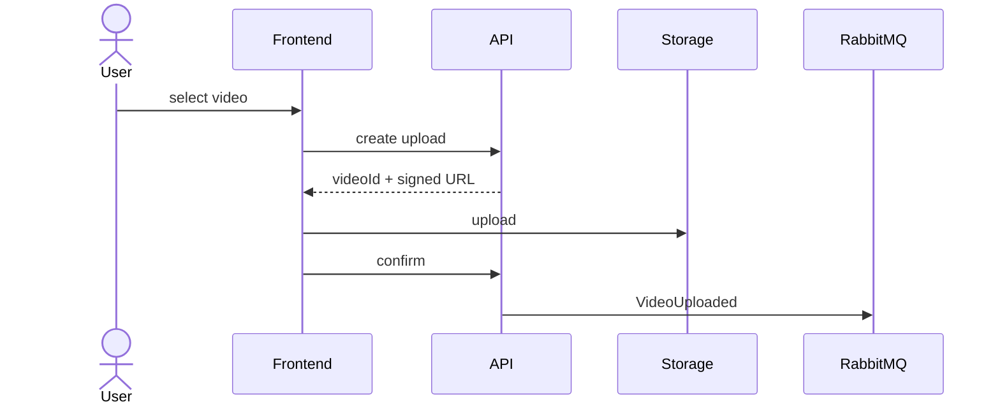

# Design — EPIC-003 — Video Management

## Context

Este design materializa os requisitos do épico sem substituir ADRs globais.

## Domain

`Video` representa ownership e lifecycle público.

## Application use cases

- `CreateVideoUpload`;
- `ConfirmVideoUpload`;
- `ListUserVideos`;
- `GetUserVideo`.

## Ports

- `VideoRepository`;
- `VideoStorage`;
- `VideoProcessingPublisher`.

## Upload flow

## Clean Architecture

- Domain não conhece provider;
- Application define ports;
- Infrastructure implementa;
- Presentation traduz transportes;
- Main compõe.

## Error strategy

- Domain Error para violação de negócio;
- Application Error para falhas de caso de uso quando necessário;
- provider errors mapeados na borda;
- Presentation mapeia erros para HTTP/message behavior.

## Security

Aplicar ownership, validation e secret hygiene quando aplicável.

## Observability

Adicionar correlation IDs e logs nos boundaries relevantes.

## Alternatives

Alternativas relevantes devem virar task decision ou ADR quando tiverem impacto futuro.

## Exit criteria

Design pronto quando não houver decisão material pendente para iniciar TDD.
