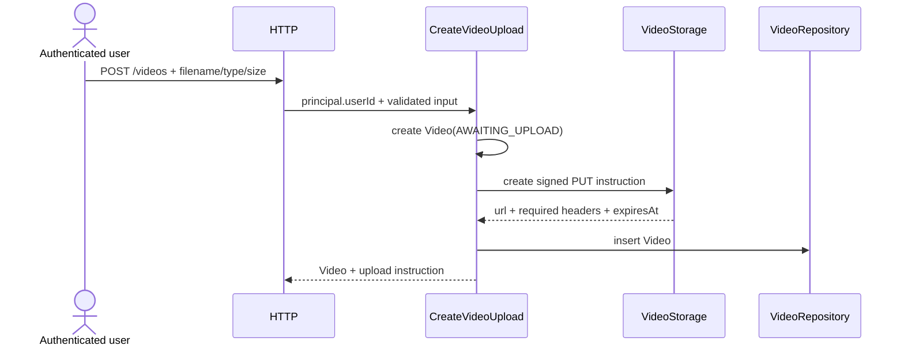
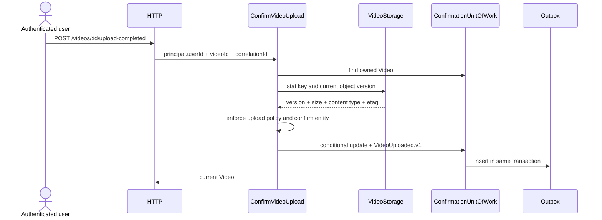

# Design — EPIC-003 — Video Management

## Context

Video Management owns the public lifecycle, ownership and ingestion boundary. It does not inspect media contents or process frames. Identity supplies the internal `UserId`; Video Processing starts from the public integration event.

## Domain

### Video

`Video` is an entity identified by `VideoId` with:

- `ownerId: UserId`;
- `originalFilename` for display only;
- declared `contentType` and `sizeBytes`;
- deterministic `storageKey`;
- `objectVersion` and verified object metadata after confirmation;
- public `status` and nullable `progress`;
- `uploadExpiresAt`, `createdAt` and `uploadedAt`.

### Lifecycle

```text
AWAITING_UPLOAD --confirm valid object--> PENDING
PENDING         --EPIC-004-------------> ANALYZING
ANALYZING       --EPIC-004-------------> PROCESSING
PROCESSING      --EPIC-005-------------> AGGREGATING
AGGREGATING     --EPIC-005-------------> COMPLETED
PENDING|ANALYZING|PROCESSING|AGGREGATING -> FAILED
```

Rules delivered here:

- creation always starts in `AWAITING_UPLOAD`;
- only `AWAITING_UPLOAD` performs the confirmation transition;
- confirming a state at or after `PENDING` is an idempotent success and never creates another event;
- `progress` is `null` until processing provides a value;
- owner, ID and storage key are immutable;
- filename never determines a filesystem or object path.

`VideoId`, `OriginalFilename`, `VideoContentType`, `VideoSize` and `VideoStatus` are explicit value objects when validation or semantics justify them.

## Application use cases

- `CreateVideoUpload`;
- `ConfirmVideoUpload`;
- `ListUserVideos`;
- `GetUserVideo`;
- `DispatchPendingIntegrationEvents`.

Every public use case receives the authenticated `UserId`; no use case accepts `firebaseUid`, bearer token or client-provided owner ID.

## Application ports

- `VideoRepository`: create, find owned video and cursor-based owned listing;
- `VideoStorage`: create signed upload instruction and inspect a specific object version;
- `VideoConfirmationUnitOfWork`: conditional state update plus outbox insert in one PostgreSQL transaction;
- `OutboxRepository`: claim with lease, mark published and schedule retry;
- `IntegrationEventPublisher`: persistent publish with broker confirmation;
- `VideoIdGenerator`, `EventIdGenerator` and `Clock`.

Ports expose domain/application types. MinIO, PostgreSQL, RabbitMQ and NestJS types do not cross into Application.

## Create upload flow



Generating an unused signed URL is harmless if persistence fails. A video is never persisted when signing fails.

## Confirm upload flow



The transactional update uses `WHERE id = :id AND user_id = :owner_id AND status = 'AWAITING_UPLOAD'`. If no row is changed, the use case reloads the owned video: a state at or after `PENDING` is returned as idempotent success; missing/foreign resources remain `404`.

## Reliable publication

The request transaction does not call RabbitMQ. A dispatcher:

1. claims available outbox rows with a lease using `FOR UPDATE SKIP LOCKED`;
2. publishes a persistent message to durable exchange `video.events` with routing key `video.uploaded.v1`;
3. waits for publisher confirm;
4. marks the row published;
5. on failure, releases/schedules retry with bounded exponential backoff.

Publishing is at-least-once. `eventId` is stable across attempts. Consumer idempotency remains mandatory in EPIC-004.

## Persistence

### `videos`

Required EPIC-003 columns:

- `id uuid primary key`;
- `user_id uuid not null references users(id)`;
- `original_filename varchar(255) not null`;
- `declared_content_type varchar(100) not null`;
- `declared_size_bytes bigint not null`;
- `storage_key varchar(512) not null unique`;
- `object_version varchar(255) null`;
- `verified_content_type varchar(100) null`;
- `verified_size_bytes bigint null`;
- `etag varchar(255) null`;
- `status varchar(32) not null` with check constraint;
- `progress numeric(5,2) null` with check `0 <= progress <= 100`;
- `upload_expires_at timestamptz not null`;
- `uploaded_at timestamptz null`;
- `created_at timestamptz not null`;
- `updated_at timestamptz not null`.

Indexes:

- `(user_id, created_at DESC, id DESC)` for listing;
- `(status, created_at)` for operational queries;
- unique `storage_key`.

### `outbox_messages`

Contains event envelope, JSON payload, attempts, availability/lease fields, publication timestamp and last sanitized error. A partial index covers unpublished/available rows. Unique `(aggregate_id, event_type, event_version)` prevents duplicate `VideoUploaded.v1`.

## Listing

`GET /videos` uses keyset pagination:

```text
ORDER BY created_at DESC, id DESC
WHERE user_id = :owner
  AND (created_at, id) < (:cursorCreatedAt, :cursorId)
LIMIT :limit + 1
```

Cursor is opaque URL-safe Base64 carrying a versioned `(createdAt, id)` payload. It is decoded and validated in Presentation before Application. Default limit is 20; maximum is 100.

## HTTP error strategy

| Condition | Status | Code |
|---|---:|---|
| invalid body, UUID, cursor or limit | 400 | `INVALID_VIDEO_REQUEST` / `INVALID_CURSOR` |
| unsupported media type | 415 | `UNSUPPORTED_VIDEO_TYPE` |
| declared or verified size exceeds policy | 413 | `VIDEO_TOO_LARGE` |
| video missing or owned by another user | 404 | `VIDEO_NOT_FOUND` |
| object missing at confirmation | 409 | `VIDEO_UPLOAD_NOT_FOUND` |
| object metadata differs from declaration | 409 | `VIDEO_UPLOAD_MISMATCH` |
| transition cannot be confirmed | 409 | `VIDEO_UPLOAD_INVALID_STATE` |
| Object Storage unavailable while request needs it | 503 | `VIDEO_STORAGE_UNAVAILABLE` |

RabbitMQ downtime does not fail a completed confirmation because publication is asynchronous through outbox.

## Security

- Authentication guard from EPIC-002 protects all endpoints;
- ownership is enforced in repository queries and conditional writes;
- foreign resources intentionally use the same `404` as missing resources;
- bucket has no anonymous policy and enables versioning;
- credentials and signed URLs are never logged;
- filename is metadata only, normalized, bounded and stripped of control characters;
- request DTOs reject unknown fields and external values are validated;
- `correlationId` is generated server-side when a valid one is not supplied.

## Infrastructure and composition

Adapters:

- `PostgresVideoRepository` and `PostgresVideoConfirmationUnitOfWork`;
- `MinioVideoStorage` behind S3-compatible semantics;
- `PostgresOutboxRepository`;
- `RabbitMqIntegrationEventPublisher`.

`main/modules/video-management.module.ts` composes ports and adapters. Infrastructure does not import `main`; Presentation does not import Infrastructure.

Local Compose adds MinIO, an idempotent bucket initializer, RabbitMQ and topology initialization. PostgreSQL, MinIO and RabbitMQ readiness checks are aggregated by the existing health use case.

## Observability boundary

Until EPIC-007, preserve only the minimum contract required for supportability:

- propagate/generate `correlationId` into the outbox event;
- do not log credentials, authorization header, signed URL or event payload containing sensitive metadata;
- expose health state without internal error strings.

## Exit criteria

The design is ready for TDD when contracts, policies, migrations, event envelope, error mapping, concurrency behavior and test evidence are reflected in tasks and traceability.
