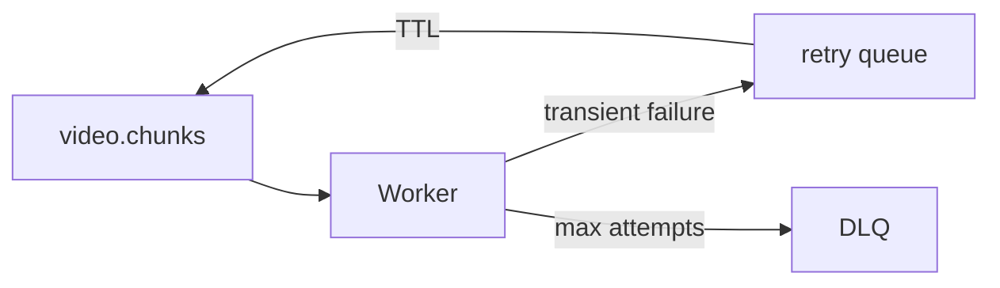

# Design — EPIC-004 — Distributed Video Processing

## Context

Este design materializa os requisitos do épico sem substituir ADRs globais.


## Analyzer

Port:

```ts
interface VideoMetadataReader {
  read(input: ReadVideoMetadataInput): Promise<VideoMetadata>;
}
```

Infrastructure adapter usa `ffprobe`.

## Chunk policy

Configuração inicial:

```text
< 2 min     -> 1 chunk
2-10 min    -> 2 min
10-30 min   -> 5 min
> 30 min    -> 5-10 min
```

A política deve ser testável e configurável.

## Worker port

```ts
interface VideoFrameExtractor {
  extract(input: ExtractFramesInput): Promise<ExtractionResult>;
}
```

Infrastructure usa `child_process.spawn` com FFmpeg.

## Idempotency

Antes de processar:

```text
if chunk.status == COMPLETED:
    ACK
    return
```

## Retry

Fluxo:



## Concurrency

`VIDEO_PROCESSOR_CONCURRENCY` configurável.


## Clean Architecture

- Domain não conhece provider;
- Application define ports;
- Infrastructure implementa;
- Presentation traduz transportes;
- Main compõe.

## Error strategy

- Domain Error para violação de negócio;
- Application Error para falhas de caso de uso quando necessário;
- provider errors mapeados na borda;
- Presentation mapeia erros para HTTP/message behavior.

## Security

Aplicar ownership, validation e secret hygiene quando aplicável.

## Observability

Adicionar correlation IDs e logs nos boundaries relevantes.

## Alternatives

Alternativas relevantes devem virar task decision ou ADR quando tiverem impacto futuro.

## Exit criteria

Design pronto quando não houver decisão material pendente para iniciar TDD.
